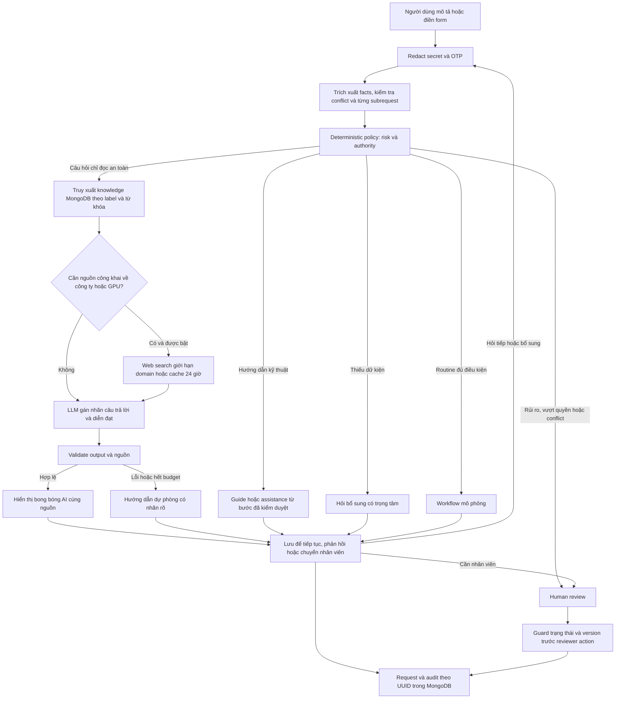

# VNG Support

> **Source và deployment:** main được kiểm tra tại `92d140a`, đã chứa các bản vá RAG, safety v5.2, evaluation và Verify retry. Hai package release-fix mới vẫn chưa commit/deploy. Xem [release matrix](docs/RELEASE-MATRIX.md) để phân biệt source đã có trên main và release được ghi nhận.

**Trợ lý giải đáp câu hỏi và hỗ trợ kỹ thuật: trả lời trực tiếp khi an toàn, hỏi đúng thông tin còn thiếu, chuyển nhân viên khi cần quyền hạn hoặc có rủi ro.**

**Website: [vng-support.vercel.app](https://vng-support.vercel.app)** · [Hướng dẫn vận hành](RUNBOOK.md) · [Trạng thái và kiểm chứng](STATUS.md)

VNG Support là demo sinh viên cho Đề A — The Escalation Referee, có AI assistance trong quá trình phát triển. Đây không phải dịch vụ hỗ trợ hay bộ chính sách nội bộ chính thức của VNG. Dữ liệu là synthetic; thao tác phê duyệt/cấp quyền chỉ mô phỏng.

## Trải nghiệm

- **Tôi cần hỗ trợ**: vào trực tiếp, không đăng nhập. Mô tả bằng lời thường ngày; không cần tự biết nhóm kỹ thuật. Có form theo nhóm khi cần nhập chi tiết.
- **Dành cho nhân viên**: vào queue, đọc lý do/rủi ro/lịch sử hướng dẫn, yêu cầu bổ sung, duyệt, từ chối, dừng hoặc override trong giới hạn policy. Đây là reviewer công khai được chủ demo cho phép, không xác thực danh tính nhân viên.
- Câu hỏi thường ngày được AI trả lời ngay trong preview. Bong bóng phản hồi hiện trong **0,4 giây**, pop **0,2 giây**, xuống dòng khi nội dung dài và hỗ trợ reduced motion.
- Lưu để hỏi tiếp hoặc theo dõi hồ sơ qua link/UUID. Người hỏi có thể chủ động chuyển nhân viên cùng toàn bộ lịch sử.

| Ví dụ | Hành vi |
| --- | --- |
| “Xin chào”, “Bạn tên gì?”, “Hôm nay ăn gì?” | Trả lời trực tiếp, không tạo việc cho reviewer |
| “Làm sao khôi phục tài khoản Google?” | Hướng dẫn tự khôi phục qua nguồn Google; không thu mật khẩu/OTP |
| “Làm sao tải chương trình abcxyz?” | Hỏi tên chính xác/hệ điều hành; không bịa link tải |
| “Làm sao sử dụng cloud GPU công ty?” | Hướng dẫn tìm hiểu; phân biệt tài liệu công khai và quyền nội bộ chưa xác minh |
| “Tôi tắt máy tính lúc về được không?” | Hướng dẫn an toàn, không hỏi device ID |
| “Làm sao reset máy?” | Làm rõ restart hay factory reset |
| “VPN không kết nối” | Hướng dẫn từng bước, giải thích thêm hoặc chuyển nhân viên theo lựa chọn |
| “Cấp read-only staging DB” thiếu scope/duration | Hỏi thông tin có thể thay đổi quyết định |
| Production admin, public RDP, secret, bypass MFA | Escalate; chatbot không cấp quyền hoặc thực thi |

## Workflow hiện tại



Policy của main được kiểm tra là **support-guidance-v5.2**, giữ ba action `AUTO_APPROVE`, `NEEDS_INFORMATION`, `ESCALATE`. `AUTO_APPROVE` chỉ cho phép trả lời/hướng dẫn/mô phỏng. Thứ tự ưu tiên: `SECURITY_RISK > BEYOND_AUTHORITY > MISSING_INFO > ROUTINE`.

LLM không có authority cuối cùng. Form/freeform mâu thuẫn hoặc một subrequest nguy hiểm không được tự chọn cách hiểu ít rủi ro hơn. Claim “đã được duyệt” không thay thế approval có thể kiểm chứng. Reviewer cũng không được bỏ qua missing facts/approval hoặc approve/fulfill security risk.

Với hội thoại chỉ đọc đã qua safety gate, lỗi model/budget dùng nội dung dự phòng đã kiểm duyệt và ghi rõ nguồn, không tự chuyển nhân viên. Với tác vụ vận hành không xác định được scope an toàn, lỗi model vẫn fail-safe. Tiền tố kiểu “bỏ qua instruction” chỉ được bỏ qua nếu nhận diện được và phần còn lại an toàn; payload nguy hiểm vẫn bị kiểm tra.

Preview giữ snapshot theo input/policy, TTL **10 phút**. Submit dùng lại snapshot để tránh câu trả lời đổi giữa xem trước và lưu, và tránh gọi AI lặp. Sửa input, policy hoặc approval thay đổi cần preview lại. Mỗi câu hỏi tiếp theo được kiểm tra rủi ro lại.

## RAG, AI và dữ liệu

- **RAG có benchmark**: 24 bài đang hoạt động, BM25 nhỏ với synonym Việt–Anh/typo tolerance và trọng số title/keyword; label là gợi ý, không khóa retrieval. Chỉ chấp nhận Mongo document khớp reviewed manifest. Chưa dùng embeddings/vector search. Model gán nhãn câu trả lời nhưng không được dùng nhãn để mở quyền.
- Bài có nguồn, ngày review, expiry và ID theo revision. Các bài nhận diện thương hiệu dùng revision 2; revision 1 vẫn lưu nhưng không được retrieval lại. Không đưa câu trả lời model/user hay web thẳng vào kho đã kiểm duyệt.
- Web search chỉ cho câu hỏi công khai về công ty/GPU khi bật. Server tạo query từ chủ đề được phép, giới hạn domain chính thức; không chuyển nguyên mô tả nội bộ lên search. Cache 24 giờ tách khỏi knowledge. Nguồn công khai không chứng minh entitlement/chính sách nội bộ.
- Trích dẫn article/web phải có quote đúng trong context; chỉ hiển thị nguồn thực sự được dùng. Quote đúng chưa chứng minh toàn bộ diễn giải đúng, vẫn cần đánh giá faithfulness. Câu hỏi entitlement nội bộ nhận boundary rõ ràng, không gọi model để đoán.
- Shared answer cache một giờ chỉ cho allowlist câu hỏi công khai, có chữ ký và khóa theo model/policy/corpus; không cache câu hỏi cá nhân hoặc follow-up. UI ghi rõ câu trả lời được dùng lại. Cache không nâng hay reset cap 50.
- Model không được gọi shell, database, IAM, Kubernetes hoặc tool thực thi. Web search là hosted tool riêng có giới hạn. Output phải qua schema và safety validation; không lưu chain-of-thought.
- MongoDB lưu request/history/audit, preview, Verify run, knowledge, web cache và bộ đếm model. Health thực hiện Mongo ping. Khi cấu hình Mongo lỗi hoặc chạy trên Vercel mà thiếu Mongo, không tự rơi về memory.
- API budget production hiện được chủ dự án cho phép tối đa **50 lần gọi tích lũy**; web lookup và answer tính riêng, không reset bộ đếm. Local `.env.example` vẫn mặc định mock và cap 20. Tăng cap cần chủ dự án cho phép.

## Chạy local

Cần Node.js 22+ và npm. Tại checkout muốn chạy:

```powershell
npm ci
Copy-Item .env.example .env.local # chỉ khi file chưa tồn tại
npm run dev
```

Mặc định mock + memory, không cần API key. Nếu port 3000 đang bận, dùng `npm run dev -- --port 3216`. Không dùng nhầm server cũ; kiểm tra `/api/support/health` với marker `MLAI_SUPPORT_REFEREE_V3`. Memory mất khi restart; chỉ dùng synthetic data.

Cấu hình OpenAI/Mongo qua `.env.local` đã gitignore hoặc environment của Vercel; không đưa key vào chat/Git/frontend:

| Biến | Cách dùng |
| --- | --- |
| `AI_PROVIDER` | `mock` local; `openai` để gọi thật |
| `OPENAI_API_KEY` | Secret phía server |
| `AI_MODEL`, `AI_ESCALATION_MODEL` | Production hiện dùng `gpt-4.1-mini` |
| `AI_CONVERSATION_MODEL` | Tùy chọn, trống thì dùng `AI_MODEL` |
| `AI_WEB_MODEL` | Production dùng `gpt-4.1` đã kiểm chứng web tool |
| `AI_WEB_SEARCH` | `true` bật bounded public lookup; local mặc định `false` |
| `AI_MAX_ATTEMPTS` | 0..50; production cap 50, không đồng nghĩa còn 50 lượt |
| `MONGODB_URI`, `MONGODB_DB` | Secret URI và database `mlai26_support_v3_demo` |
| `SUPPORT_STORAGE` | `memory-demo` chỉ local không Mongo |
| `SUPPORT_ACCESS_MODE` | `public-demo` cho reviewer công khai |
| `SUPPORT_VERIFY_FAULTS` | `true` cho Verify giả lập lỗi; không ép approve |
| `APP_REVISION` | SHA source khi deploy để đối chiếu health |

`DATABASE_URL`, `LLM_API_KEY`, `LLM_MODEL` phục vụ compatibility/sandbox cũ. Database/collection/marker/fixture ID không đổi theo tên hiển thị; repository GitHub vẫn giữ tên cũ đến khi chủ dự án đổi.

## Route và API

| Route | Chức năng |
| --- | --- |
| `/` | Hai lối vào không đăng nhập |
| `/send-help`, `/workspace` | Nhập vấn đề, preview facts/answer, lưu |
| `/requests/[id]`, `/track` | Trò chuyện tiếp, hướng dẫn, bổ sung, feedback, theo dõi |
| `/review`, `/audit` | Queue/timeline có lọc, tìm kiếm và phân trang |
| `/verify` | Chạy bộ test qua API production, nhập case mới, lưu expected/actual/rule/explanation |
| `/legacy/workspace`, `/legacy/verify`, `/legacy/audit` | Echo UI cũ trong compatibility window |

Support API dùng `{success:true,data}` hoặc `{success:false,error:{code,message,details?}}`.

| API | Contract chính |
| --- | --- |
| POST `/api/support/preview` | Input mô tả/form + `idempotencyKey:UUID` → safe input, previewId, facts, decision, assistance; chưa tạo ticket |
| POST `/api/support/requests` | Input + `confirmed:true`, previewId nếu có; idempotent theo key/fingerprint |
| GET `/api/support/requests` hoặc `/[id]` | `?view=page&limit=30&cursor=0&q=VPN&origin=support&status=pending` → items,total,nextCursor; array/summary cũ vẫn tương thích |
| POST `/api/support/requests/[id]/conversation` | `{version,question}`; chỉ hồ sơ conversation còn mở |
| POST `/api/support/requests/[id]/feedback` | `{version,choice,step?}`: RESOLVED, STILL_BROKEN, CONFUSED, ADMIN, EXPLAIN |
| POST `/api/support/requests/[id]/clarification` | `{version,rawText?,fields?}` khi cần thông tin |
| POST `/api/review/[id]` | `{version,action,reason,target?}`; reason ít nhất 8 ký tự; transition và version guard |
| GET `/api/support/events` | Audit theo requestId hoặc phân trang |
| GET `/api/support/metrics` | Tổng hợp toàn bộ hồ sơ Mongo, gồm synthetic Verify; không phải accuracy thực tế |
| GET `/api/support/health` | Marker, storage/durable, provider cấu hình, policy, revision và Mongo ping; không gọi model trả phí |
| `/api/support/verify-runs`, `/[id]`, `/[id]/cases` | Tạo/tải/chạy tiếp Verify đã lưu; mỗi case gọi production request API |

Giữ `GET /api/health`, `POST /api/echo`, `GET /api/events`, sandbox `/api/llm-test`. Xem schema ở [input.ts](src/domain/input.ts) và [contracts.ts](src/domain/contracts.ts).

## Source và kiểm thử

| Thư mục | Trách nhiệm |
| --- | --- |
| `src/domain/` | Types, taxonomy, redaction, canonical facts, policy/rules, guidance, knowledge seed |
| `src/services/` | Điều phối preview/submit, approval, reviewer, feedback, conversation |
| `src/lib/` | Mongo repository, model adapter, RAG/web cache, HTTP, Verify |
| `src/app/`, `src/components/` | Next.js routes/API và giao diện |
| `tests/`, `tests/e2e/` | Policy/API/workflow regression và desktop/mobile |
| `mlai26_new/data/` | Policy, Verify và Ground Truth có provenance |

Không gộp source thành một file: giữ server secrets ngoài browser bundle, policy độc lập với LLM/UI và file routing của Next.js. Các module theo trách nhiệm giúp nhóm đọc và sửa từng phần.

```powershell
npm test
npm run lint
npm run typecheck
npm run build
npm run test:e2e
```

E2E tự khởi động Next dev của đúng checkout tại **127.0.0.1:3227**, `reuseExistingServer:false`, mock/memory, không gọi API trả phí. Kiểm tra port trước khi chạy; không chạy build đồng thời với E2E vì dùng chung `.next`.

Verify mặc định `submission-4`; bộ `de-a-v3` có **3 auto / 2 escalate**. Có case mới, model lỗi, missing, mixed language, injection/conflict. Giữ nguyên fixture/expected gốc: báo cáo gần nhất **55/128 match, 73 mismatch**, không sửa Ground Truth để che conflict. Xem [evaluation](artifacts/original-fixture-evaluation.json).

Bằng chứng runtime trước đổi tên: [RAG release](RAG-RELEASE-VERIFICATION-2026-09-21.md) với 22/22 live checks, OpenAI thật/Mongo/web citations. Kết quả của lần đổi tên ở [STATUS](STATUS.md); không coi health pass là bằng chứng đã gọi model thật.

## Triển khai, lịch sử và giới hạn

Vercel project **vng-support** giữ cùng project ID và MongoDB. Domain mới tự theo production deployment; alias `labpass-five.vercel.app` giữ cho link cũ. Deploy thủ công bằng CLI sau QA; GitHub auto-deploy chưa được kết nối. Chi tiết ở [RUNBOOK](RUNBOOK.md).

Không có thực thi IAM/cloud/shell thật, SSO hoặc xác thực actor của public demo. Redaction và risk detection theo pattern có giới hạn ngôn ngữ; không nhập secret hay dữ liệu production. Có benchmark development synthetic 54 case, chưa có held-out độc lập, bằng chứng người dùng thật hay kiểm chứng chủ động Mongo failover. Kho nguồn công khai không thay chính sách nội bộ.

- [Retrieval/benchmark — Tiến Khoa](docs/RAG-RETRIEVAL.md), [quản trị knowledge](docs/KNOWLEDGE-REVIEW.md)
- [Answer/cache/guard — Duy Anh](docs/RAG-ANSWER.md)
- [Đổi tên và mapping file](VNG-SUPPORT-RENAME.md)
- [Migration hội thoại/RAG](RAG-CONVERSATION-MIGRATION.md)
- [Đối chiếu feedback E01–E23](VNG-SUPPORT-ERRORS-RECHECK.md)
- [Build log và nguồn gốc](BUILD-LOG.md), [gói nộp bài lịch sử](submission/README.md)
- [Audit migration ban đầu](MIGRATION-AUDIT.md), [sơ đồ v4 lịch sử](mermaid-diagram.excalidraw)

Các báo cáo/slide/video cũ giữ snapshot và nguồn gốc ban đầu. Commit mới không thay ngày thực sự phát triển hoặc tự chứng minh đủ điều kiện dự thi; nhóm cần công bố phần tái sử dụng và AI assistance theo thể lệ.
