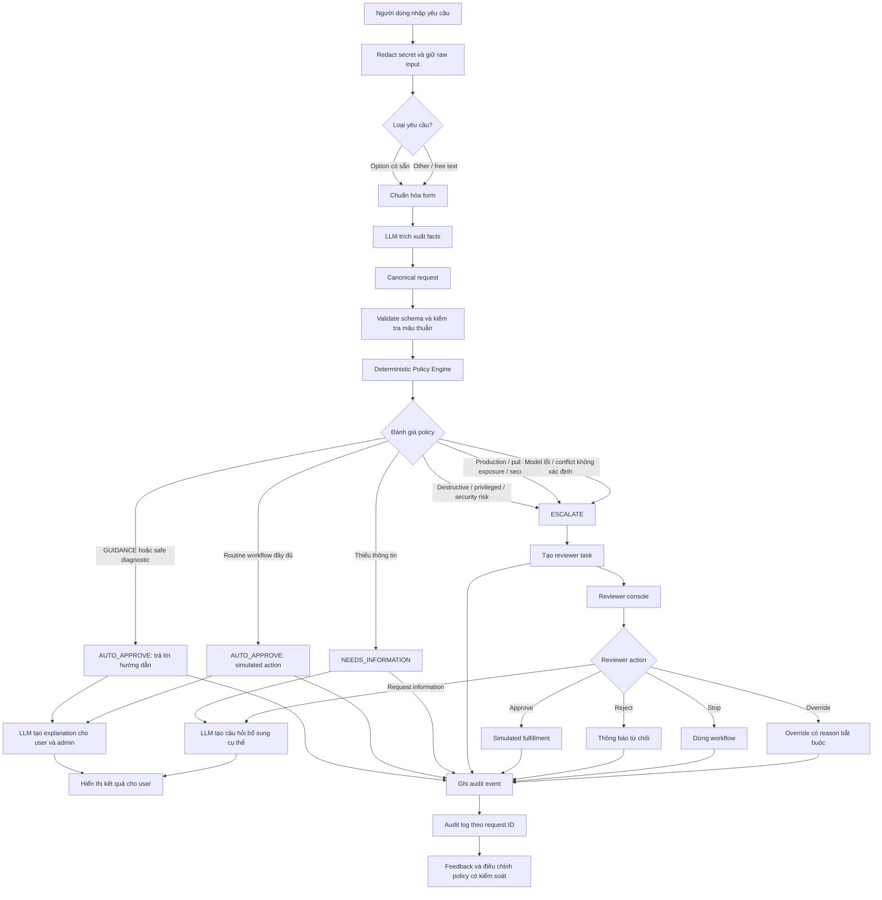

# VNG Tech Support Escalation Referee


Demo hỗ trợ kỹ thuật Đề A, phát triển tiếp từ generic Next.js skeleton trong repository này. Dữ liệu, approval và policy đều synthetic; không phải policy chính thức của VNG. Hai lối vào **I need help** và **Admin** không yêu cầu đăng nhập trong demo công khai.

Nhánh `codex/support-v3-migration` dùng lại giao diện orange/NAVI, Nunito/Baloo2 và bố cục hỗ trợ của prototype, nối với policy/workflow v3. Theo yêu cầu cập nhật ngày 20/09/2026, `main` đã nhận toàn bộ implementation này, gồm `src/`. Nguồn UI tái sử dụng và phạm vi thay đổi được ghi trong [UI-RESTORATION.md](UI-RESTORATION.md); commit mới không thay đổi nguồn gốc code cũ.

## Chạy ứng dụng

```powershell
npm ci
Copy-Item .env.example .env.local
npm run db:generate
npm run dev
```

Mở http://localhost:3000. Nếu port đã có process khác, dùng `npm run dev -- --port 3216`. Không ghi đè file `.env.local` đang có. Mặc định dùng model mock và memory, không cần secret hay tài khoản trả phí. Memory mất khi restart và không chia sẻ giữa server instances.

## Workflow thực tế

Input → redact → preview facts → user xác nhận → deterministic policy → hướng dẫn / hỏi thêm / workflow mô phỏng / human review → audit → feedback.

- Shutdown/restart: GUIDE-001, không hỏi device ID. Reset chưa rõ: hỏi restart hay factory reset.
- VPN/Wi-Fi và troubleshooting trung bình: các bước đã kiểm duyệt, lựa chọn A hoàn thành / B còn lỗi / C không hiểu / D admin. C/D giữ toàn bộ lịch sử và tạo reviewer task.
- Production, quyền đặc quyền, secret, public exposure, bỏ kiểm soát bảo mật, wipe hoặc conflict: escalate; không có hạ tầng thật được gọi.
- Thiếu scope/duration/approval xác minh: NEEDS_INFORMATION. Claim “manager đã approve” không là verified approval.
- Reviewer có Approve, Reject, Request information, Stop, Override và hoàn tất mô phỏng. Reject/Override cần lý do; version guard chặn thao tác trên trạng thái cũ. SECURITY_RISK không được approve/fulfill. Quyết định policy ban đầu vẫn giữ khi người review thay trạng thái.

`AUTO_APPROVE` chỉ cho phép hướng dẫn hoặc workflow mô phỏng; không cấp quyền, phát credential hoặc thay đổi production.

## Sơ đồ luồng xử lý

Sơ đồ dưới đây mô tả luồng từ intake, redact và trích xuất facts đến deterministic policy, hướng dẫn người dùng, reviewer console và audit/feedback. Bản có thể chỉnh sửa nằm tại [mermaid-diagram.excalidraw](mermaid-diagram.excalidraw).



## Route và contract

| Route | Chức năng |
| --- | --- |
| `/send-help`, `/workspace` | Cùng form: freeform nhóm + mô tả; structured taxonomy/fields v3; preview, quay lại sửa, xác nhận |
| `/requests/[id]` | Kết quả, hướng dẫn, feedback, làm rõ và audit |
| `/review`, `/review?requestId=UUID` | Queue có lọc chờ xử lý/tất cả; link chi tiết, thao tác có guard |
| `/verify` | Đề A v3, extended v3, fixture gốc, judge input mới |
| `/audit` | Timeline theo request ID và số đếm feedback demo |
| `/legacy/workspace`, `/legacy/verify`, `/legacy/audit` | UI echo cũ trong compatibility window |

API dùng envelope `{success:true,data}` hoặc `{success:false,error:{code,message,details?}}`. Xem request schema ở `src/domain/input.ts` và decision contract tại `src/domain/contracts.ts`.

| API | Contract chính |
| --- | --- |
| POST `/api/support/preview` | `{rawText,fields?,serviceGroup?,requestKind?,mode?,idempotencyKey:UUID}` → safe input, canonical facts, decision; không lưu request |
| POST `/api/support/requests` | Cùng input + `confirmed:true` → request, version, decision, assistance, embedded audit; idempotent theo UUID + fingerprint |
| GET `/api/support/requests` hoặc `/[id]` | Queue 200 hồ sơ gần đây hoặc chi tiết |
| POST `/api/support/requests/[id]/feedback` | `{version,choice:RESOLVED|STILL_BROKEN|CONFUSED|ADMIN}` |
| POST `/api/support/requests/[id]/clarification` | `{version,rawText,fields?}` chỉ khi NEEDS_INFORMATION |
| POST `/api/review/[id]` | `{version,action,reason?,target?}`; target chỉ cho override |
| GET `/api/support/events?requestId=UUID` | Audit an toàn; không có secret gốc hay chain-of-thought |
| GET `/api/support/metrics` | Số đếm 200 hồ sơ synthetic gần nhất, không phải production accuracy |
| GET `/api/support/health` | Marker `MLAI_SUPPORT_REFEREE_V3`, storage, provider, policy version; liveness, không kiểm tra DB/provider |

Compatibility giữ `GET /api/health`, `POST /api/echo`, `GET /api/events` và sandbox `/api/llm-test`. Envelope echo thông thường không đổi; secret values nay redact và exception provider/DB không đưa vào response/log. Chi tiết thay đổi và thời hạn trong [migration note](mlai26_new/data/policy/support-v3-migration.md).

## Cấu trúc source

`domain/`: types, catalog, rule data, extraction deterministic, redaction, policy, guidance và transitions. `services/`: orchestration, scoped approval, review/feedback. `lib/`: HTTP, storage, model adapter và Verify client. `app/` và `components/`: API/routes/UI.

Không gộp thành một file: server secrets và model adapter không được đưa vào bundle trình duyệt; policy cần độc lập với UI/LLM; Next.js dùng file routing. Giữ hàm và module theo trách nhiệm, không thêm framework nội bộ. Catalog đầy đủ không đồng nghĩa mọi integration đã tự động hóa; request chưa có safe path sẽ hỏi thêm hoặc review.

## Model và storage

- `AI_PROVIDER=mock` mặc định, UI ghi rõ mock. `openai` cần `OPENAI_API_KEY`, `AI_MODEL`, `AI_ESCALATION_MODEL` phía server. Không có live call nào được dùng để xác nhận kết quả QA hiện tại.
- Model trích xuất facts, không nhận quyền quyết định. Schema strict, evidence là quote trong input; scope/entity phải có evidence; risk được tính lại. Assistance chỉ chọn/reorder bước trong safe catalog. Explanation cho user/admin luôn dùng deterministic templates nên vẫn có khi model lỗi.
- JSON mode không bảo đảm schema; Zod vẫn bắt buộc. Adapter chặn refusal/truncation/timeout, không tool calls, không retries, `store:false`, tối đa 20 lần gọi trong budget. [OpenAI structured outputs](https://developers.openai.com/api/docs/guides/structured-outputs).
- `MONGODB_URI` + `MONGODB_DB` lưu request, history và audit trong cùng document bằng optimistic version CAS. Collection riêng `v3_support_requests`, `v3_model_budgets`. Chưa kiểm chứng live Mongo/restart với credential thật.
- PostgreSQL/Prisma và `DATABASE_URL` chỉ phục vụ generic event compatibility. Không migrate hoặc xóa dữ liệu cũ.
- Production cần Mongo hoặc chủ động chọn `SUPPORT_STORAGE=memory-demo` (chỉ demo tạm); reviewer production cần `SUPPORT_ACCESS_MODE=public-demo`. Không dùng app public này cho dữ liệu thật hoặc authority thật.

## Verify và kiểm thử

```powershell
npm test
npm run lint
npm run typecheck
npm run build
npm run test:e2e
```

Verify gọi cùng `POST /api/support/requests`, không hàm quyết định riêng. Đề A v3 có đúng 3 auto / 2 escalate; extended có guidance, medium, missing, model lỗi, mixed, injection/conflict. Bộ Verify gốc 5 case và Ground Truth gốc 123 case giữ nguyên; mismatch hiển thị công khai, không đổi expected để đạt pass. Test kiểm tra SHA256 nguồn gốc. Report tại `artifacts/original-fixture-evaluation.json`.

E2E khởi động Next dev (cùng CLI như `npm run dev`) trên 127.0.0.1:3216 với `reuseExistingServer:false`, mock, memory và model budget 0; mỗi test xác nhận marker app. Không sử dụng process port 3000. Hướng dẫn demo, persistence và deployment trong [RUNBOOK](RUNBOOK.md); evidence mới nhất trong [STATUS](STATUS.md).

## Nguồn gốc và giới hạn

Migration này được Astra/Codex hỗ trợ viết, không được mô tả là sinh viên tự viết toàn bộ. Generic scaffold và tài liệu đã tồn tại trước migration; xem [BUILD-LOG](BUILD-LOG.md), [audit trước code](MIGRATION-AUDIT.md), [TEAM-PLAN](TEAM-PLAN.md). Commit mới ghi nhận thay đổi tại thời điểm commit; không thay đổi ngày thực sự phát triển hoặc tự chứng minh đủ điều kiện dự thi. Nhóm cần công bố phần tái sử dụng và AI assistance theo thể lệ thực tế.

Không có IAM, shell, cloud, DB execution, ticket system hoặc SSO integration thật. Redaction/risk detection theo pattern có giới hạn ngôn ngữ; chỉ nhập synthetic data. Demo công khai không xác thực danh tính actor. Kết quả test không phải chứng nhận production security hay accuracy trên dữ liệu thực.
