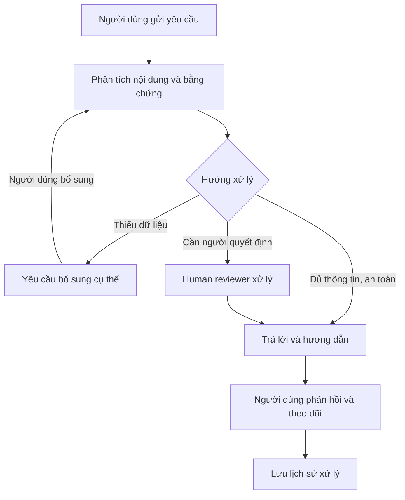

# VNG Support — Trợ lý tiếp nhận và xử lý yêu cầu

**VNG Support** giúp người dùng gửi vấn đề, nhận hướng dẫn, bổ sung thông tin và theo dõi quá trình xử lý trong một cuộc hội thoại. Human reviewer có không gian riêng để tiếp nhận yêu cầu, xem bằng chứng và đưa ra quyết định.

Sản phẩm tham gia **MLAI 2026 · Track VNG · Đề A: The Escalation Referee**.

**[Mở VNG Support](https://vng-support.vercel.app)** · **[Mã nguồn](https://github.com/dakiemdarktharr/DOCRELAY_MLAI2026)**

## Bạn có thể làm gì?

- **Gửi yêu cầu theo hai cách:** mô tả vấn đề bằng lời hoặc chọn theo danh mục.
- **Nhận phản hồi theo ngữ cảnh:** đọc hướng dẫn, hỏi tiếp và bổ sung dữ liệu ngay trong yêu cầu.
- **Theo dõi tiến độ:** tra cứu bằng mã hoặc liên kết yêu cầu, xem phản hồi và lịch sử xử lý.
- **Phối hợp với human reviewer:** chuyển hỗ trợ khi cần, tiếp nhận câu hỏi bổ sung và quyết định của người xử lý.
- **Kiểm tra workflow:** chạy bộ kiểm thử, đối chiếu kết quả và mở yêu cầu tương ứng để xem chi tiết.
- **Dùng trên máy tính và điện thoại:** mở URL trực tiếp hoặc quét QR từ nút **URL / QR** ở góc trên trái.

## Bắt đầu sử dụng

1. Mở [website](https://vng-support.vercel.app).
2. Đọc popup hướng dẫn, cuộn để xem đầy đủ nội dung và bấm **Đã hiểu**.
3. Chọn **Tôi cần hỗ trợ** để gửi yêu cầu hoặc **Dành cho nhân viên** để vào không gian human reviewer.

Mũi tên hướng dẫn sẽ chỉ các nút và ô cần thao tác khi bạn vào từng vai trò lần đầu. Quay lại cùng vai trò trong tab hiện tại sẽ tiếp tục sử dụng bình thường. Đóng tab và mở lại website sẽ bắt đầu lượt hướng dẫn mới.

### Người gửi yêu cầu

1. Chọn **Tôi cần hỗ trợ**.
2. Chọn **Mô tả vấn đề** hoặc **Chọn theo danh mục**.
3. Chọn **Phòng ban**, điền ID nhân viên nếu có, rồi nhập vấn đề và các thông tin liên quan.
4. Bấm **Gửi** để nhận phản hồi. Đọc hướng dẫn hoặc câu hỏi bổ sung; có thể quay lại sửa nội dung.
5. Bấm **Xác nhận và gửi yêu cầu** để lưu yêu cầu. Với luồng trò chuyện, chọn **Lưu và tiếp tục trò chuyện**.
6. Tại trang theo dõi, dùng **Hỏi tiếp**, **Gửi bổ sung** hoặc phản hồi kết quả xử lý. Chọn chuyển cho nhân viên khi cần hỗ trợ thêm.
7. Giữ lại mã hoặc liên kết yêu cầu. Mở **Theo dõi yêu cầu** để tra cứu vào lần sau.

### Human reviewer

1. Từ trang đầu, chọn **Dành cho nhân viên**.
2. Trong **Yêu cầu cần xử lý**, tìm theo mã hoặc nội dung. Dùng bộ lọc trạng thái và nguồn yêu cầu để chọn danh sách cần xem.
3. Mở một yêu cầu để đọc nội dung, hội thoại, thông tin đã thu thập và lý do chuyển tiếp.
4. Chọn thao tác phù hợp đang hiển thị: hỏi thêm thông tin, duyệt, từ chối, dừng hoặc điều chỉnh quyết định. Điền lý do khi giao diện yêu cầu.
5. Mở **Lịch sử xử lý** để xem diễn biến và các quyết định đã được ghi nhận.

### Kiểm tra các tính năng

1. Trong không gian nhân viên, mở **Kiểm thử**.
2. Chọn bộ **Đề A — 5 trường hợp** hoặc bộ **15 tình huống**, rồi chạy kiểm thử.
3. Xem kết quả thực tế, kết quả kỳ vọng và phần giải thích của từng trường hợp.
4. Mở yêu cầu tương ứng để kiểm tra hội thoại, quyết định và lịch sử. Trong danh sách reviewer, chọn nguồn **Case Verify** để tìm các yêu cầu này.
5. Có thể nhập tình huống riêng trên trang Kiểm thử để xem hệ thống xử lý.

### Mở trên điện thoại bằng QR

Bấm **URL / QR** ở góc trên trái, dùng camera điện thoại quét mã và mở liên kết. Bạn sẽ tới trang chọn người gửi yêu cầu hoặc human reviewer. Trong cùng popup, dùng **Sao chép URL** để chia sẻ liên kết website.

## Workflow



Hệ thống sử dụng thông tin và bằng chứng để xác định bước tiếp theo. Khi thiếu dữ liệu, người gửi nhận yêu cầu bổ sung cụ thể. Khi cần người quyết định, human reviewer xem nội dung và chọn cách xử lý; tiến độ được cập nhật trong yêu cầu.

## Các trang chính

| Trang | Công dụng |
| --- | --- |
| [Trang đầu](https://vng-support.vercel.app/) | Chọn vai trò và mở hướng dẫn |
| [Gửi yêu cầu](https://vng-support.vercel.app/send-help) | Nhập vấn đề và bắt đầu hội thoại |
| [Theo dõi yêu cầu](https://vng-support.vercel.app/track) | Tra cứu bằng mã hoặc liên kết |
| [Yêu cầu cần xử lý](https://vng-support.vercel.app/review) | Không gian human reviewer |
| [Lịch sử xử lý](https://vng-support.vercel.app/audit) | Xem diễn biến và quyết định |
| [Kiểm thử](https://vng-support.vercel.app/verify) | Chạy các tình huống và đối chiếu kết quả |

## Chạy trên máy của bạn

Cài **Node.js 22 trở lên** và **npm**, sau đó mở terminal tại thư mục repository:

```bash
npm ci
cp .env.example .env.local
npm run dev
```

Nếu dùng Windows PowerShell, thay lệnh sao chép bằng:

```powershell
Copy-Item .env.example .env.local
```

Mở **http://localhost:3000**. Cấu hình mẫu dùng phản hồi mô phỏng và bộ nhớ cục bộ để thử các luồng ngay sau khi khởi động.

Các lệnh kiểm tra dành cho người phát triển:

```bash
npm run lint
npm run typecheck
npm test
npm run build
npm run test:e2e
```

Xem thêm [hướng dẫn giám khảo](docs/JUDGE-ONBOARDING.md), [hướng dẫn vận hành](RUNBOOK.md) và [hồ sơ sản phẩm](submission/README.md).
