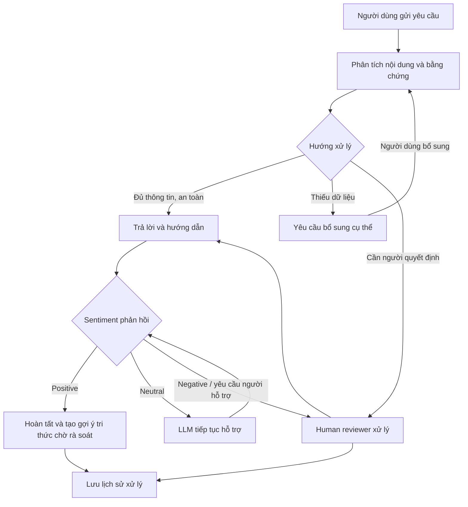

# VNG Support — Trợ lý tiếp nhận và xử lý yêu cầu

**VNG Support** giúp người dùng gửi vấn đề, nhận hướng dẫn, bổ sung thông tin và theo dõi quá trình xử lý trong một cuộc hội thoại. Human reviewer có không gian riêng để tiếp nhận yêu cầu, xem bằng chứng và đưa ra quyết định.

Sản phẩm tham gia **MLAI 2026 · Track VNG · Đề A: The Escalation Referee**.

**[Mở VNG Support](https://vng-support.vercel.app)** · **[Mã nguồn](https://github.com/dakiemdarktharr/DOCRELAY_MLAI2026)**

README này mô tả các luồng trong repository hiện tại. Bản trên website có thể chạy commit khác; đối chiếu `sourceRevision` theo [runbook](RUNBOOK.md#đối-chiếu-bản-triển-khai) trước khi dùng làm bằng chứng cho một bản phát hành.

## Bạn có thể làm gì?

- **Gửi yêu cầu theo hai cách:** mô tả vấn đề bằng lời hoặc chọn theo danh mục.
- **Nhận phản hồi theo ngữ cảnh:** đọc hướng dẫn, hỏi tiếp và bổ sung dữ liệu ngay trong yêu cầu.
- **Theo dõi tiến độ:** tra cứu bằng mã hoặc liên kết yêu cầu, xem phản hồi và lịch sử xử lý.
- **Phối hợp với human reviewer:** chuyển hỗ trợ khi cần, tiếp nhận câu hỏi bổ sung và quyết định của người xử lý.
- **Kiểm tra workflow:** chạy bộ kiểm thử, đối chiếu kết quả và mở yêu cầu tương ứng để xem chi tiết.
- **Dùng trên máy tính và điện thoại:** mở URL trực tiếp hoặc quét QR từ nút **URL / QR** ở góc trên trái.

## Bắt đầu sử dụng

1. Mở [website](https://vng-support.vercel.app).
2. Đọc popup hướng dẫn, cuộn để xem đầy đủ nội dung và bấm **Đã hiểu**.
3. Chọn **Tôi cần hỗ trợ** để gửi yêu cầu hoặc **Dành cho nhân viên** để vào không gian human reviewer.

Mũi tên hướng dẫn sẽ chỉ các nút và ô cần thao tác khi bạn vào từng vai trò lần đầu. Quay lại cùng vai trò trong tab hiện tại sẽ tiếp tục sử dụng bình thường. Đóng tab và mở lại website sẽ bắt đầu lượt hướng dẫn mới.

### Người gửi yêu cầu

1. Chọn **Tôi cần hỗ trợ**.
2. Chọn **Mô tả vấn đề** hoặc **Chọn theo danh mục**.
3. Chọn **Phòng ban**, nhập **Mã nhân viên** (bắt buộc), rồi nhập vấn đề và các thông tin liên quan.
4. Bấm **Gửi** để nhận phản hồi. Đọc hướng dẫn hoặc câu hỏi bổ sung; có thể quay lại sửa nội dung.
5. Bấm **Xác nhận và gửi yêu cầu** để lưu yêu cầu. Với luồng trò chuyện, chọn **Lưu và tiếp tục trò chuyện**.
6. Sau câu trả lời đầu tiên, nhập phản hồi tự do. Sentiment positive hoàn tất yêu cầu và tạo gợi ý tri thức chờ người phụ trách biên tập; neutral tiếp tục hội thoại; negative hoặc yêu cầu người hỗ trợ chuyển reviewer cùng lịch sử. Có thể dùng nút **Tôi đã làm được** hoặc **Chuyển cho nhân viên** thay cho câu tự do.
7. Giữ lại mã hoặc liên kết yêu cầu. Mở **Theo dõi yêu cầu** để tra cứu vào lần sau.

### Human reviewer

1. Từ trang đầu, chọn **Dành cho nhân viên**.
2. Trong **Yêu cầu cần xử lý**, tìm theo mã nhân viên, mã yêu cầu hoặc nội dung. Dùng bộ lọc trạng thái và nguồn yêu cầu để chọn danh sách cần xem.
3. Mở một yêu cầu để đọc nội dung, hội thoại, thông tin đã thu thập và lý do chuyển tiếp.
4. Chọn thao tác phù hợp đang hiển thị: hỏi thêm thông tin, duyệt, từ chối, dừng hoặc điều chỉnh quyết định. Điền lý do khi giao diện yêu cầu.
5. Mở **Lịch sử xử lý** để xem diễn biến và các quyết định đã được ghi nhận.

Dashboard có nút chọn nhanh **Chờ xử lý**, **Ngoài quy định**, **Cần thẩm quyền** và **Gợi ý tri thức**. Có thể tìm bằng mã nhân viên, mã ngắn `HT-…` đang hiển thị hoặc nội dung. **Xóa bộ lọc** mở lại tất cả trạng thái/nguồn; bộ lọc và từ khóa được giữ trong session của tab khi quay lại từ chi tiết. Nếu trình duyệt chặn session storage, thao tác lọc vẫn hoạt động nhưng không được khôi phục sau điều hướng. Chỉ dùng dữ liệu demo đã ẩn danh trong ô tìm kiếm.

### Kiểm tra các tính năng

1. Trong không gian nhân viên, mở **Kiểm thử**.
2. Chọn bộ kiểm thử chung **4 trường hợp**, bộ **Đề A — 5 trường hợp**, hoặc bộ **15 tình huống**, rồi bấm **Chạy toàn bộ test** một lần.
3. Xem kết quả thực tế, kết quả kỳ vọng và phần giải thích của từng trường hợp.
4. Mở yêu cầu tương ứng để kiểm tra hội thoại, quyết định và lịch sử. Trong danh sách reviewer, chọn nguồn **Case Verify** để tìm các yêu cầu này.
5. Có thể nhập tình huống riêng trên trang Kiểm thử để xem hệ thống xử lý.

Bộ 4 case theo challenge brief gồm hai hướng dẫn tự động, một câu hỏi bổ sung và một yêu cầu RDP public cần dừng vì rủi ro bảo mật. Bộ Đề A giữ riêng 3 case tự động và 2 case chuyển tiếp.

### Mở trên điện thoại bằng QR

Bấm **URL / QR** ở góc trên trái, dùng camera điện thoại quét mã và mở liên kết. Bạn sẽ tới trang chọn người gửi yêu cầu hoặc human reviewer. Trong cùng popup, dùng **Sao chép URL** để chia sẻ liên kết website.

## Workflow


```mermaid
flowchart TD
    A[Người dùng gửi yêu cầu] --> B[Phân tích nội dung và bằng chứng]
    B --> C{Hướng xử lý}
    C -->|Đủ thông tin, an toàn| D[Trả lời và hướng dẫn]
    C -->|Thiếu dữ liệu| E[Yêu cầu bổ sung cụ thể]
    E -->|Người dùng bổ sung| B
    C -->|Cần người quyết định| F[Human reviewer xử lý]
    F --> D
    D --> G{Sentiment phản hồi}
    G -->|Positive| I[Hoàn tất và tạo gợi ý tri thức chờ rà soát]
    G -->|Neutral| J[LLM tiếp tục hỗ trợ]
    J --> G
    G -->|Negative / yêu cầu người hỗ trợ| F
    I --> H[Lưu lịch sử xử lý]
    F --> H
```

Classifier sentiment rule-based chỉ xử lý phản hồi sau câu trả lời, không thay deterministic policy hoặc risk check. Gợi ý tri thức từ ticket positive không được tự động xuất bản hoặc đưa vào retrieval: người phụ trách phải kiểm tra nguồn và biên tập thành revision theo [quy trình knowledge](docs/KNOWLEDGE-REVIEW.md). Khi thiếu dữ liệu, người gửi nhận yêu cầu bổ sung cụ thể; khi cần người quyết định, reviewer xem lịch sử và chọn cách xử lý.

Seed và câu tổng hợp nằm trong `mlai26_new/data/sentiment/post-answer-feedback.json`: 14 câu do người dùng cung cấp và 30 câu tổng hợp. Runtime dùng rule-based classifier; corpus được kiểm tra như regression phát triển, chưa dùng để huấn luyện model hoặc đo accuracy trên dữ liệu giữ riêng. Phủ định, tình trạng còn lỗi và câu hỏi tiếp được ưu tiên hơn dấu hiệu đã giải quyết; nội dung có rủi ro phải qua policy trước khi được ghi nhận hoàn tất.

Có thể mô tả vấn đề bằng câu bình thường: “tôi không vào acc youtube được” và câu có thêm “làm sao để vào?” cùng đi vào hướng dẫn tài khoản an toàn. Không cần dấu hỏi. Nếu chưa có nguồn phù hợp, trợ lý hỏi làm rõ thay vì khẳng định đã xử lý tài khoản.

Reviewer có bộ lọc **Hàng đợi chuyển tiếp**: **Ngoài quy định** để chủ chính sách/Security xem xét và **Cần thẩm quyền** cho người phê duyệt/team xử lý. Mỗi yêu cầu hiển thị nơi tiếp nhận. Thiếu dữ kiện tiếp tục hỏi người gửi; bộ lọc không cấp quyền phê duyệt hoặc gửi thông báo tới người thật.

## Các trang chính

| Trang | Công dụng |
| --- | --- |
| [Trang đầu](https://vng-support.vercel.app/) | Chọn vai trò và mở hướng dẫn |
| [Gửi yêu cầu](https://vng-support.vercel.app/send-help) | Nhập vấn đề và bắt đầu hội thoại |
| [Theo dõi yêu cầu](https://vng-support.vercel.app/track) | Tra cứu bằng mã hoặc liên kết |
| [Yêu cầu cần xử lý](https://vng-support.vercel.app/review) | Không gian human reviewer |
| [Lịch sử xử lý](https://vng-support.vercel.app/audit) | Xem diễn biến và quyết định |
| [Kiểm thử](https://vng-support.vercel.app/verify) | Chạy các tình huống và đối chiếu kết quả |

## I.D — Mock Employee RBAC

Danh bạ mock có 36 hồ sơ nằm trong [`data/employees.csv`](data/employees.csv). CSV là nguồn dữ liệu duy nhất cho API và tra cứu danh tính RBAC; API kiểm tra ID trong CSV theo ID sinh từ họ tên trước khi dùng hồ sơ. Level là số nguyên từ `00` đến `36` (miền giá trị có 37 level); các level không xuất hiện trong 36 hồ sơ vẫn hợp lệ cho policy.

Đây là dataset mô phỏng của dự án, không phải danh sách nhân viên thật hoặc cơ cấu quyền chính thức của VNG. Form hỗ trợ bắt buộc nhập **Mã nhân viên** để nhóm các yêu cầu khai cùng mã và cho reviewer/audit tra cứu theo mã. Mã được bỏ khoảng trắng ngoài và chuẩn hóa chữ thường khi lưu; mã phải dài tối đa 32 ký tự, bắt đầu bằng chữ hoặc số, các ký tự còn lại gồm chữ, số, `_` hoặc `-`. Đây là mã do người gửi khai báo, chưa được xác thực với danh bạ nhân sự và không cấp quyền reviewer. Mã và phòng ban chỉ dùng làm metadata quản lý, không đi vào phân tích/model. API danh bạ và RBAC vẫn dùng header riêng, không tự lấy ID từ form. Khi triển khai với nhân sự thật, cần nối trường này với SSO/danh bạ HR để xác minh người gửi.

### Dataset ID nhân viên

| ID mock | Họ tên mock | Level | Chức danh mô phỏng | Phòng ban mô phỏng |
| --- | --- | --- | --- | --- |
| alphanvgl | Nhân Viên Giả Lập Alpha | 36 | Chief Executive Officer (CEO) | Executive Board |
| anhtn | Trần Ngọc Anh | 35 | Chief Technology Officer (CTO) | Executive Board |
| dunglv | Lê Văn Dũng | 34 | Managing Director | VNGGames |
| linhth | Trần Hoàng Linh | 33 | Vice President | ZaloPay |
| minhnd | Nguyễn Đăng Minh | 32 | Senior Director | AI Cloud |
| haonv | Nguyễn Văn Hào | 31 | Director | Data platform |
| huongtt | Trịnh Thị Hương | 30 | Head of Department | Human Resources |
| phuongnt | Nguyễn Thành Phương | 28 | Deputy Head | Legal |
| khanhnd | Nguyễn Duy Khánh | 26 | Senior Manager | ZaloPay Operations |
| tuanha | Hoàng Anh Tuấn | 24 | Project Manager | VNGGames |
| trangtt | Trần Thu Trang | 22 | Team Leader | Frontend Engineering |
| namhp | Hoàng Phan Nam | 21 | Assistant Team Leader | Backend Engineering |
| bachnt | Nguyễn Thành Bách | 20 | Principal Engineer | AI Cloud |
| longvt | Vũ Tiến Long | 18 | Lead Architect | Data platform |
| maivt | Vũ Thị Mai | 17 | Senior Level II | UI/UX Design |
| quanhm | Hoàng Minh Quân | 16 | Senior Level I | DevOps |
| thuynt | Nguyễn Thị Thủy | 15 | Engineer Level III | Backend Engineering |
| hieupm | Phạm Minh Hiếu | 12 | Engineer Level II | Frontend Engineering |
| sonnv | Nguyễn Văn Sơn | 09 | Engineer Level I | QC/QA |
| vynt | Nguyễn Thảo Vy | 06 | Junior Developer | Mobile Engineering |
| ducna | Nguyễn Anh Đức | 05 | Fresher Developer | AI Cloud |
| yenph | Phạm Hoàng Yến | 03 | Long-term Intern | Data platform |
| khoanm | Nguyễn Minh Khoa | 02 | Short-term Intern | Frontend Engineering |
| binhnt | Nguyễn Thành Bình | 01 | Contractor | IT Support |
| tamnt | Nguyễn Thanh Tâm | 00 | Collaborator | Game Localization |
| cuongnv | Nguyễn Văn Cường | 15 | Specialist Level III | Finance & Accounting |
| oanhnt | Nguyễn Thị Oanh | 12 | Specialist Level II | Human Resources |
| hungpv | Phan Văn Hùng | 09 | Specialist Level I | Marketing |
| dungtt | Trần Tiến Dũng | 24 | Product Owner | ZaloPay |
| lanht | Hoàng Thị Lan | 22 | Team Leader | Customer Service |
| kienvd | Vũ Đăng Kiên | 17 | Senior Artist II | VNGGames |
| ngocpt | Phạm Thị Ngọc | 16 | Senior Specialist I | Legal |
| haidv | Đinh Văn Hải | 12 | Business Analyst II | ZaloPay |
| nhannt | Nguyễn Thành Nhân | 06 | Junior Specialist | Marketing |
| quynhnt | Nguyễn Thị Quỳnh | 05 | Fresher Specialist | Human Resources |
| thangnv | Nguyễn Văn Thắng | 00 | Collaborator | Creator Management |

Khi cần thay đổi hồ sơ, cập nhật CSV và kiểm tra lại bảng này. ID `oanhnt` và `nhannt` là các ID đã sửa trong phiên bản `878448f`; không dùng các ID cũ `oanhtn` hoặc `nhant`.

### Thử API danh bạ ở local

`GET /api/employees` trả toàn bộ danh bạ cho nhân viên level 21 trở lên. Route dùng `X-Employee-ID` để mô phỏng danh tính: thiếu ID hoặc ID không có trong CSV nhận `401`, level dưới 21 nhận `403`. Đây là xác thực mock để trình diễn RBAC, không phải đăng nhập an toàn hoặc danh tính đã xác minh.

```powershell
Invoke-RestMethod http://localhost:3000/api/employees -Headers @{
  "X-Employee-ID" = "trangtt"
}
```

Phản hồi thành công chứa mảng 36 hồ sơ trong `data`, với `level` là số (ví dụ `00` trong CSV thành `0` trong JSON), và header `Cache-Control: no-store`.

| Header `X-Employee-ID` | Kết quả | Ý nghĩa |
| --- | --- | --- |
| `namhp` (level 21) hoặc `trangtt` (22) | `200` | Đủ ngưỡng xem danh bạ mock |
| `bachnt` (20) hoặc `tamnt` (00) | `403` | ID tồn tại nhưng dưới ngưỡng 21 |
| Bỏ header hoặc `synthetic_unknown_employee` | `401` | Chưa cung cấp ID hoặc không có trong CSV |
| ID hợp lệ khi CSV không đọc/validate được | `500` | Danh bạ không khả dụng; không trả nội dung lỗi nội bộ |

Header được trim và chuyển thành chữ thường, nên `TRANGTT` cũng khớp `trangtt`. Chạy các ví dụ trên server local; không dùng header tự khai báo này làm xác thực production.

ID được sinh bởi `generateEmployeeId(fullName)`: bỏ dấu tiếng Việt, lấy phần tên cuối làm gốc rồi nối chữ cái đầu của các phần đứng trước theo thứ tự. Ví dụ hoàn toàn giả lập: `Nhân Viên Giả Lập Alpha` → `alphanvgl`. Tên có thể sinh trùng ID; bộ đọc CSV từ chối ID trùng, không tự phân biệt hồ sơ trùng tên. `checkAuthorityLevel(minRequiredLevel)` tạo guard kiểm tra level tối thiểu; `AUTHORITY_LEVELS` định nghĩa các mốc `intern=0`, `professional=6`, `management=21`, `executive=31`.

Hiện chỉ `GET /api/employees` gắn guard này, với ngưỡng `management=21`. Chưa có scope theo người được giao task, project, phòng ban hoặc quyền duyệt tài chính. Các mốc level không tự cấp quyền cho workflow IT/reviewer, không thay deterministic policy và không thay SSO. Mã nguồn: [bộ đọc CSV và sinh ID](src/domain/employees.ts), [guard level](src/lib/employee-rbac.ts), [route danh bạ](src/app/api/employees/route.ts).

## Chạy trên máy của bạn

Cài **Node.js 22 trở lên** và **npm**, sau đó mở terminal tại thư mục repository:

```bash
npm ci
cp .env.example .env.local
npm run dev
```

Nếu dùng Windows PowerShell, thay lệnh sao chép bằng:

```powershell
Copy-Item .env.example .env.local
```

Mở **http://localhost:3000**. Cấu hình mẫu dùng phản hồi mô phỏng và bộ nhớ cục bộ để thử các luồng ngay sau khi khởi động.

Các lệnh kiểm tra dành cho người phát triển:

```bash
npm run lint
npm run typecheck
npm test
npm run build
npm run test:e2e
```

Build phải hoàn tất trước E2E. Để kiểm tra production build bằng mock/memory trên server riêng `127.0.0.1:3227`, dùng các lệnh desktop/mobile tách biệt trong [runbook](RUNBOOK.md#kiểm-tra-trước-khi-phát-hành).

Ở commit `878448f`, kiểm tra **local** đạt 505 unit/integration tests (32 file), 11 kiểm tra guard Mongo và 89 E2E (45 desktop, 44 mobile; bỏ qua một bài quay video mobile). Lint, typecheck và build đạt. Đây là kết quả AI-assisted đã ghi cho commit đó, không phải bằng chứng hosted CI hoặc production hiện tại. Xem [phạm vi và kết quả kiểm tra UI](docs/UI-REVIEW-VNG.md). Lượt cập nhật README này chỉ kiểm tra tính khớp của tài liệu với CSV/code và các liên kết local; không chạy lại toàn bộ bộ kiểm thử ứng dụng.

Xem thêm [hướng dẫn giám khảo](docs/JUDGE-ONBOARDING.md) và [hướng dẫn vận hành](RUNBOOK.md).

## Giới hạn bằng chứng và dữ liệu demo

Chỉ nhập dữ liệu synthetic hoặc đã ẩn danh trước. Redaction che một số credential, OTP và CCCD/số điện thoại theo nhãn và định dạng hỗ trợ; không đảm bảo che tên, email, địa chỉ hoặc mọi dạng PII. Bộ lọc reviewer không phải phân quyền theo team và chưa gửi thông báo tới người thật.

Evaluator trả `caller-declared-unverified`; nhãn held-out hoặc consented-anonymized do caller khai báo không xác minh tính độc lập/consent. Bằng chứng chưa có giữ trạng thái `NOT_COLLECTED`. Health `durable=true` mô tả Mongo adapter, còn `persistenceVerification=NOT_PERFORMED` cho biết endpoint không kiểm tra đọc lại sau restart. CI mock/memory không chứng minh model thật, Mongo production hay hiệu quả người dùng. Xem [đối chiếu kỹ thuật và các quyết định còn thiếu](docs/FEEDBACK-EVIDENCE-REVIEW.md).
