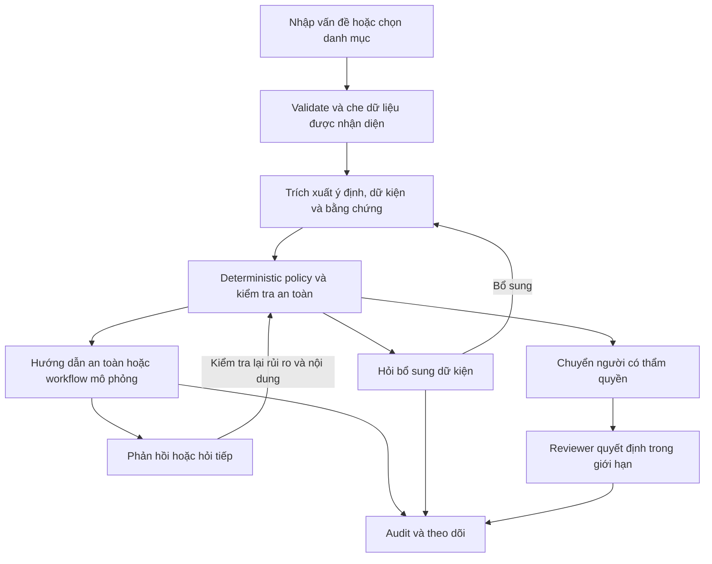

# VNG Support

### Trợ lý IT Helpdesk — biết khi nào hướng dẫn, khi nào cần con người

VNG Support tiếp nhận vấn đề bằng ngôn ngữ tự nhiên, giúp người gửi làm rõ yêu cầu, nhận hướng dẫn an toàn và theo dõi xử lý trong một cuộc hội thoại. Khi thiếu căn cứ, ngoài quy định hoặc vượt thẩm quyền, hệ thống hỏi bổ sung hoặc chuyển người phụ trách với bằng chứng và câu hỏi cụ thể.

Dự án sinh viên cho **MLAI Hackathon 2026 · OrganizationAI · Đề A: The Escalation Referee**, theo bối cảnh hỗ trợ IT của VNG. Policy trong repo là **quy định mô phỏng/đề xuất của dự án**, chưa phải chính sách chính thức hay hệ thống production được VNG xác nhận.

**[Mở ứng dụng](https://vng-support.vercel.app)** · **[Trải nghiệm hỗ trợ](https://vng-support.vercel.app/send-help)** · **[Verify cho giám khảo](https://vng-support.vercel.app/verify)** · **[Hướng dẫn trong app](https://vng-support.vercel.app/help)** · **[Runbook](RUNBOOK.md)**

Repository: **[dakiemdarktharr/vng-support](https://github.com/dakiemdarktharr/vng-support)**, trước đây là `DOCRELAY_MLAI2026`. App chạy từ thư mục gốc; `mlai26_new/` giữ dữ liệu và tài liệu, không phải ứng dụng thứ hai. Website có thể chạy commit khác: đối chiếu `sourceRevision` theo [runbook](RUNBOOK.md#đối-chiếu-bản-triển-khai).

## Bắt đầu sử dụng

Trang đầu có hai lựa chọn:

| Bạn muốn làm gì? | Cách bắt đầu |
| --- | --- |
| Gửi yêu cầu bằng ID đã cấp | **Tôi cần hỗ trợ → Đăng nhập**; nhập ID còn hiệu lực. |
| Thử hỗ trợ mà chưa có tài khoản | **Tôi cần hỗ trợ → Hướng dẫn & tùy chọn → Trải nghiệm demo**; nhập phòng ban và mã nhân viên giả lập. |
| Xin cấp ID mới | **Tôi cần hỗ trợ → Nhân viên mới?**; gửi đơn, lưu liên kết riêng và chờ IT duyệt. |
| Tiếp nhận, xử lý hoặc kiểm thử | **Dành cho nhân viên**; mở hàng đợi, lịch sử hoặc Verify. |

Nút **URL / QR** giúp sao chép URL hoặc mở app trên điện thoại. Hướng dẫn lần đầu chỉ vị trí thao tác theo vai trò; có thể mở lại từ **Hướng dẫn demo** ở màn hình đăng nhập. Giao diện hỗ trợ desktop/mobile, bàn phím và chế độ giảm chuyển động.

### Người gửi yêu cầu

1. Vào **Gửi yêu cầu**, chọn **Mô tả vấn đề** hoặc **Chọn theo danh mục**.
2. Chọn **Phòng ban** và nhập **Mã nhân viên**. Phiên đăng nhập tự điền ID; luồng demo dùng mã giả lập, chẳng hạn `EMP-DEMO-01`, không tạo tài khoản thật.
3. Viết điều đang gặp, ví dụ “VPN không kết nối” hoặc “Máy in bị kẹt”. Không cần đặt thành câu hỏi; không cần biết trước nhóm hỗ trợ. Các trường nâng cao chỉ bổ sung khi có dữ kiện.
4. Bấm **Gửi** để xem trước cách hệ thống hiểu yêu cầu, hướng dẫn hoặc câu hỏi làm rõ. Preview **chưa tạo hồ sơ yêu cầu**; dùng **Quay lại sửa** nếu cần.
5. Chọn **Xác nhận và gửi yêu cầu**, hoặc **Lưu và tiếp tục trò chuyện** khi đang trong nhánh hội thoại.
6. Hỏi tiếp, trả lời câu hỏi bổ sung hoặc phản hồi kết quả. **Tôi đã làm được** ghi nhận đã giải quyết; **Chuyển cho nhân viên** chuyển hỗ trợ cùng lịch sử.
7. Lưu liên kết hoặc mã UUID đầy đủ để tra cứu tại **Theo dõi yêu cầu**. Mã ngắn `HT-…` dùng nhận biết và tìm trong reviewer/audit; trang theo dõi cần liên kết hoặc mã đầy đủ.

### Người xử lý yêu cầu hỗ trợ

Mở **Dành cho nhân viên → Yêu cầu cần xử lý**. Tìm theo nội dung, mã nhân viên hoặc mã `HT-…`; lọc nhanh **Chờ xử lý**, **Ngoài quy định**, **Cần thẩm quyền**, **Gợi ý tri thức**. Từ khóa/bộ lọc được giữ trong session của tab, với fallback khi trình duyệt chặn session storage.

Mở hồ sơ để xem nội dung gốc, hướng dẫn đã trả, dữ kiện, lý do chuyển tiếp và audit. Có thể yêu cầu bổ sung, duyệt, từ chối, dừng, điều chỉnh quyết định hoặc ghi nhận hoàn tất tùy trạng thái; server kiểm tra chuyển trạng thái, version và lý do. Yêu cầu rủi ro bảo mật không được duyệt/hoàn tất bằng nút reviewer demo. Thao tác dừng/điều chỉnh cập nhật workflow và audit, **không hoàn tác tài nguyên bên ngoài**.

Không gian reviewer hỗ trợ hiện là **public demo**, tách khỏi quyền IT duyệt ID. Nhãn team và bộ lọc không xác thực thành viên nhóm, cấp thẩm quyền hoặc gửi thông báo cho người thật.

### Giám khảo: Verify và input mới

Đường demo ngắn, không cần tài khoản: **Trang đầu → Dành cho nhân viên → Đã hiểu → Kiểm thử → Đề A → Chạy toàn bộ test (5)**. Xem 3 routine/2 escalation, mở **Bằng chứng quyết định** và **Mở request / audit → Lịch sử yêu cầu và hướng dẫn**, rồi quay lại Verify để nhập một tình huống mới. Có thể bỏ qua tour; tour không tự chạy thao tác.

[Readiness kỹ thuật mới nhất](docs/TECHNICAL-READINESS.md) · [Đánh giá trước đó](docs/COMPETITION-READINESS.md) · [Protocol held-out/người dùng](docs/INDEPENDENT-EVALUATION-PROTOCOL.md) · [Nội dung 5 slide, video và checklist](docs/SUBMISSION-CONTENT.md). Các bằng chứng độc lập/người dùng còn thiếu được ghi `NOT COLLECTED`; không suy ra 9,5/10 từ số test đạt.

1. Mở **Kiểm thử / Verify**, chọn bộ và bấm **Chạy toàn bộ test** một lần.
2. Xem expected/actual, rule, thời điểm và liên kết hồ sơ; mở audit để đối chiếu quyết định. Có thể dừng, xem lại và tiếp tục lượt chạy đã lưu.
3. Nhập tình huống mới trong Verify hoặc form hỗ trợ. Input mới đi qua luồng xử lý ứng dụng, không nhận kết quả theo case ID.

| Bộ | Số case | Nội dung |
| --- | ---: | --- |
| Bộ chung `submission-4` | 4 | Hai case tự xử lý, một cần bổ sung, một chuyển tiếp vì RDP public. |
| Đề A `de-a-v3` | 5 | Ba case thường quy và hai case cần chuyển tiếp. |
| `judge-15` | 15 | Thiếu dữ kiện, ngoài quy định, vượt thẩm quyền, xung đột và prompt injection. |

Verify tạo request qua API và đọc lại hồ sơ, audit, queue, metrics trước khi đánh dấu PASS. Đây là kiểm tra có ghi dữ liệu; provider OpenAI được cấu hình có thể phát sinh API call. Kết quả mock chỉ chứng minh luồng mô phỏng. Xem [hướng dẫn giám khảo](docs/JUDGE-ONBOARDING.md), [các bộ dữ liệu](docs/JUDGE-DATASETS.md) và [brief cuộc thi](Challenge_Brief_OrganizationAI_VN.docx.md).

## AI tham gia như thế nào?

### 1. Workflow tổng quát


```mermaid
flowchart TD
    A[Nhập vấn đề hoặc chọn danh mục] --> B[Validate và che dữ liệu được nhận diện]
    B --> C[Trích xuất ý định, dữ kiện và bằng chứng]
    C --> D[Deterministic policy và kiểm tra an toàn]
    D --> E[Hướng dẫn an toàn hoặc workflow mô phỏng]
    D --> F[Hỏi bổ sung dữ kiện]
    D --> G[Chuyển người có thẩm quyền]
    F -->|Bổ sung| C
    E --> H[Phản hồi hoặc hỏi tiếp]
    H -->|Kiểm tra lại rủi ro và nội dung| D
    G --> I[Reviewer quyết định trong giới hạn]
    E --> J[Audit và theo dõi]
    F --> J
    I --> J
```

- **Nhận diện ý định:** với `AI_PROVIDER=openai`, freeform đủ điều kiện được model chính phân tích cả khi là câu kể, có lỗi gõ hoặc diễn đạt khác. Input theo danh mục, rủi ro rõ ràng và “reset” cần làm rõ có đường kiểm tra deterministic riêng; không phải mọi request đều gọi LLM. Provider `mock` dùng nhận diện và câu trả lời mô phỏng để chạy offline.
- **Quyết định:** Zod kiểm tra schema, evidence phải khớp input và nhánh xử lý phải nhất quán. Policy hiện tại `support-guidance-v5.9` ưu tiên `SECURITY_RISK → BEYOND_AUTHORITY → MISSING_INFO → ROUTINE`. Model không được tự phê duyệt hay bỏ qua rule. Lỗi model/schema/evidence chuyển xử lý an toàn.
- **Hướng dẫn có nguồn:** hội thoại tìm trong corpus có revision, nguồn và hạn sử dụng bằng BM25 kết hợp chuẩn hóa Việt–Anh/typo. Không dùng vector database hay embeddings. Web search chỉ bật riêng cho các chủ đề/nguồn cho phép; URL trong ticket không tự cho app quyền đọc tài liệu riêng.
- **Thiếu tài liệu công việc:** yêu cầu tạo/sửa một sản phẩm công việc mà chưa có tài liệu đầu vào được hỏi bổ sung cụ thể. App chưa có connector đọc Drive, repository, dashboard hoặc attachment riêng của người gửi; không giả vờ đã đọc tài liệu.
- **Sau câu trả lời:** sentiment rule-based giúp phân biệt đã giải quyết, cần tiếp tục và cần người hỗ trợ. Rủi ro và policy vẫn ưu tiên; câu nguy hiểm không được đánh dấu hoàn tất chỉ vì có lời cảm ơn. Phản hồi positive có thể tạo gợi ý tri thức **chờ rà soát**, không tự thêm vào kho trả lời.
- **Truy vết:** audit ghi thời điểm, actor, trạng thái trước/sau, rule, evidence, giải thích và câu hỏi tiếp theo. Không lưu chain-of-thought. Preview gắn phiên bản policy; thay policy làm preview/cache cũ không được dùng lại.

`AUTO_APPROVE` có thể là cho phép trả hướng dẫn hoặc tiếp nhận workflow mô phỏng. Nó **không chứng minh máy đã được sửa, tài khoản đã được cấp quyền, cổng đã mở hoặc hạ tầng đã thay đổi**. Người dùng/reviewer xác nhận kết quả trong workflow; dự án chưa thực thi IAM/cloud/database thật.

[Nhận diện bằng model](docs/MODEL-INTENT-ROUTING.md) · [Retrieval](docs/RAG-RETRIEVAL.md) · [Quản trị tri thức](docs/KNOWLEDGE-REVIEW.md) · [Workflow theo bằng chứng](docs/EVIDENCE-WORKFLOW-FOLLOWUP.md)

### 2. Workflow chi tiết theo module

Sơ đồ dưới mô tả các nhánh xử lý và quan hệ giữa module; không phải mọi request đều đi qua mọi ô. Đường liền là luồng dữ liệu/xử lý, đường nét đứt là cấu hình, nguồn dữ liệu hoặc đối chiếu. Các ô ghi “M1”, “M6” tham chiếu lại module đó để tránh dây nối xuyên suốt sơ đồ. Nhánh preview → xác nhận là luồng UI; API submit có thể tự phân tích khi không gửi `previewId`. Có thể mở rộng/phóng to sơ đồ Mermaid trên GitHub để đọc từng nhánh.


```mermaid
flowchart TB
    subgraph INTAKE["M1 · Tiếp nhận và chuẩn hóa"]
        UI["Form tự do / danh mục / input mới"] --> HTTP["API boundary<br/>Origin, JSON, giới hạn body/rate<br/>Kiểm tra metadata hoặc phiên ID"]
        HTTP --> SAFE["Zod input + redaction<br/>Tách metadata nhân viên khỏi dữ kiện<br/>Bỏ field rỗng khi phân tích"]
        SAFE --> BASE["extractIntake<br/>Catalog, entity, risk, subrequest<br/>Phủ định và dữ kiện mâu thuẫn"]
    end

    subgraph INTENT["M2 · Nhận diện ý định"]
        BASE --> MODE{"Cách nhận diện"}
        MODE -->|"Structured / risk rõ / reset mơ hồ"| CANON["CanonicalRequest<br/>Facts + evidence + risk + route"]
        MODE -->|"Mock"| MOCK["conversationRoute / workEvidencePlan<br/>Nhận diện offline, không gọi API"]
        MODE -->|"OpenAI, freeform đủ điều kiện"| EXTRACT["extractWithModel · AI_MODEL<br/>Chat Completions → JSON"]
        EXTRACT --> CONTRACT["Schema + quote + route/catalog<br/>Giữ risk từ baseline<br/>Sai output → gắn modelFailure"]
        MOCK --> CANON
        CONTRACT --> CANON
        CANON --> WORK["Nếu thiếu tài liệu công việc:<br/>work-evidence + checkWorkSources<br/>Ghi nguồn đã kiểm tra và phần chưa có"]
    end

    subgraph POLICY["M3 · Quyết định cuối cùng"]
        CANON --> RULES["evaluatePolicy + policy-source<br/>Ưu tiên risk / authority / missing / routine<br/>Đánh giá từng subrequest"]
        WORK --> RULES
        APPROVAL["verifyApproval<br/>Scope, role, thời hạn<br/>Approval mô phỏng của dự án"] -.-> RULES
        RULES -->|"NEEDS_INFORMATION"| ASK["clarificationPlan<br/>Trường thiếu và câu hỏi cụ thể"]
        RULES -->|"ESCALATE"| ESC["Lý do + câu hỏi chuyển tiếp<br/>Nơi tiếp nhận và bước tiếp theo"]
        RULES -->|"AUTO_APPROVE"| HANDLE{"handlingMode / conversation"}
        HANDLE -->|"GUIDE"| GUIDE["guidanceTemplate<br/>Các bước do server định nghĩa"]
        HANDLE -->|"LLM_ASSIST, không phải chat"| ASSIST["AI_MODEL chọn bước mẫu<br/>Giải thích theo evidence<br/>Validate prose và bước được phép"]
        HANDLE -->|"SIMULATED_WORKFLOW"| SIM["Kết quả workflow mô phỏng<br/>Không thực thi IAM / cloud / DB"]
        ASSIST -->|"Lỗi → modelFailure"| RULES
    end

    subgraph RAG["M4 · Hội thoại có nguồn — createConversationAnswer"]
        HANDLE -->|"conversation"| RETRIEVE["Tra cứu corpus và web tùy chọn<br/>Chạy I/O song song"]
        CORPUS["knowledge.ts + knowledge-extra.ts<br/>Revision nguồn đã khai báo review"] -.-> FILTER["retrieveKnowledge / rankKnowledge<br/>Mongo hoặc seed local<br/>Schema, nội dung, expiry, superseded"]
        RETRIEVE --> FILTER
        FILTER --> RANK["searchKnowledge<br/>Chuẩn hóa, alias Việt–Anh, typo<br/>BM25 + title/keyword → tối đa 3 bài"]
        RETRIEVE --> WEB["retrievePublicWeb nếu được bật<br/>AI_WEB_MODEL hoặc AI_MODEL<br/>Responses API + web_search<br/>Query server, domain cho phép"]
        RANK --> CACHE["Context + nguồn<br/>withAnswerCache cho câu công khai hợp lệ"]
        WEB --> CACHE
        CACHE -->|"Miss / không cache"| ANSWER["AI_CONVERSATION_MODEL hoặc AI_MODEL<br/>JSON text + knowledgeIds + evidence"]
        CACHE -->|"Hit: vẫn kiểm tra lại"| VALIDATE["validateAnswer<br/>ID, quote, URL, prose/risk<br/>Chỉ trích nguồn thực sự sử dụng"]
        ANSWER --> VALIDATE
        ANSWER -->|"Lỗi gọi model"| FALLBACK
        VALIDATE -->|"Hợp lệ"| RESPONSE["Assistance.answer<br/>Nguồn, retrieval, cacheHit, fallbackReason"]
        VALIDATE -->|"Sai / lỗi model"| FALLBACK["Fallback deterministic từ corpus<br/>Hoặc hỏi rõ khi chưa có nguồn<br/>Không suy ra quyền nội bộ"]
        FALLBACK --> RESPONSE
        RETRIEVE -->|"Policy nội bộ chưa xác minh"| FALLBACK
    end

    subgraph LIFECYCLE["M5 · Preview, lưu và hội thoại tiếp"]
        ASK --> RESULT["Kết quả phân tích"]
        ESC --> RESULT
        GUIDE --> RESULT
        ASSIST --> RESULT
        SIM --> RESULT
        RESPONSE --> RESULT
        RESULT --> PREVIEW["previewSupport<br/>Fingerprint + policyVersion<br/>Preview TTL 10 phút, chưa tạo ticket"]
        PREVIEW --> CONFIRM["Người gửi xác nhận → submitSupport<br/>Idempotency, TTL, fingerprint<br/>Kiểm tra lại policy / approval"]
        CONFIRM --> SAVE["Tiếp nhận RECEIVED<br/>Sau đó lưu quyết định / assistance / events"]
        FOLLOWUP["clarifySupport / continueConversation / feedbackSupport<br/>Kiểm tra risk trước sentiment<br/>Neutral hỏi tiếp; negative chuyển người<br/>Positive hợp lệ hoàn tất + gợi ý tri thức"] --> REANALYZE["Cần phân tích lại → M1–M4<br/>Sau đó lưu thay đổi qua M6"]
        FOLLOWUP -->|"Cập nhật trạng thái"| AUDIT
        REVIEW["reviewSupport<br/>Reason + transition + version<br/>Chặn duyệt Security risk / thiếu căn cứ"] --> AUDIT
        STORED["Hồ sơ đã lưu, đọc từ M6"] --> REVIEW
        STORED --> FOLLOWUP
    end

    subgraph STORAGE["M6 · Audit và lưu trữ Support"]
        SAVE --> AUDIT["auditEvent<br/>Actor, trước/sau, rule, evidence<br/>Policy version, lý do, câu hỏi"]
        AUDIT --> STORE[("v3_support_requests<br/>Request + assistance + feedback + events<br/>Ghi nguyên tử theo version<br/>Mongo hoặc memory-demo được phép")]
        STORE --> READ["Detail / events / metrics / auditPage<br/>Theo dõi, tìm HT, phân trang"]
    end

    subgraph IDENTITY["M7 · ID nhân viên — luồng riêng"]
        APPLY["Đơn họ tên + job/profile + scopes"] --> IDTX["identity service + identityTransaction<br/>Schema, profile/version, unique ID<br/>IT quyết định và ghi lý do"]
        AUTH["identity-auth<br/>ID ACTIVE → phiên demo<br/>OTP + identity-admin → quyền duyệt ID"] --> IDTX
        IDTX --> IDDB[("MongoDB identity_* riêng<br/>Đơn + profile + tài khoản + audit<br/>OTP / sessions / limits<br/>Không fallback memory hay CSV")]
        IDDB --> SCOPE["evaluateScope tại server<br/>Đúng scope và ít rủi ro mới allowed<br/>executed: false"]
        AUTH -.->|"Phiên người gửi"| IDREF["M1 kiểm tra ID khớp phiên nếu có"]
        AUTH -.->|"Access API cần phiên OTP"| SCOPE
    end

    subgraph VERIFY["M8 · Verify và đánh giá"]
        PACK["Verify packs 4 / 5 / 15<br/>createVerifyRun + executeVerifyCase"] --> VAPI["Gọi cùng API M1–M6<br/>Không hard-code quyết định theo case ID"]
        VAPI --> CHECK["runSupportCase<br/>Đối chiếu expected với readback từ M6<br/>Detail + events + queue + metrics"]
        CHECK --> RUNDB[("v3_verify_runs<br/>Lưu case ID, request ID, kết quả<br/>Dừng / tiếp tục")]
        EVAL["evaluation + escalation-threshold<br/>Metric từ nhãn caller khai báo<br/>Đề xuất ngưỡng, không tự kích hoạt"]
    end

    %% Invisible links only arrange the independent modules vertically.
    STORAGE ~~~ IDENTITY
    IDENTITY ~~~ VERIFY

    classDef authority fill:#fff0e6,stroke:#b83b0b,color:#202124;
    classDef data fill:#eef4fa,stroke:#46627f,color:#202124;
    class RULES,CONTRACT,VALIDATE,REVIEW,SCOPE authority;
    class STORE,IDDB,RUNDB,CORPUS data;
```

#### Model nào làm việc gì?

Tên model chính **được lấy từ cấu hình**, không hard-code một phiên bản GPT trong luồng runtime. `.env.example` để `AI_MODEL` và `AI_CONVERSATION_MODEL` rỗng, đặt `AI_PROVIDER=mock`; không thể suy ra model đang chạy trên website từ repo.

| Công đoạn | Model / cơ chế | Đầu ra và giới hạn |
| --- | --- | --- |
| M2 — hiểu câu kể/câu hỏi | `AI_MODEL`, qua `callModel` / Chat Completions khi provider OpenAI | JSON facts, intent, route, quotes; sau đó kiểm tra schema/evidence và hợp nhất risk. Không ra quyết định cấp quyền. |
| M3 — hướng dẫn đơn giản | `guidanceTemplate`, không cần LLM sinh câu trả lời | Bước hướng dẫn cố định theo catalog. |
| M3 — trợ giúp có giải thích | `AI_MODEL` | Chọn chỉ số bước từ template và giải thích theo evidence; không tạo thêm thao tác, command hay quyền. |
| M4 — trả lời hội thoại | `AI_CONVERSATION_MODEL`, để trống thì dùng `AI_MODEL` | JSON gồm text, knowledgeIds và trích dẫn evidence; model đọc context đã truy hồi, server kiểm tra trước khi hiển thị. |
| M4 — tìm web công khai | `AI_WEB_MODEL`, để trống thì dùng `AI_MODEL`; giá trị mẫu là `gpt-4.1` | Responses API với `web_search`, chỉ khi `AI_WEB_SEARCH=true` và đủ cấu hình. Tối đa một tool call; không gửi nguyên ticket làm query tìm kiếm. |
| Policy, retrieval và sentiment | TypeScript deterministic, BM25 và rule-based | Không có model embedding, reranker hoặc model sentiment riêng. |

`callModel` đặt `store: false`, tối đa 1.000 completion tokens, timeout tối đa 12 giây và `maxRetries: 0`; web đặt tối đa 1.000 output tokens và timeout 18 giây. Các lần gọi thật chia sẻ counter `AI_MAX_ATTEMPTS`. Đây là giới hạn từng call, không phải cam kết thời gian hoặc tổng token của một yêu cầu. `workflow-prompt.ts` bổ sung nguyên tắc làm việc theo bằng chứng cho lời gọi qua `callModel`; nó không thay policy.

#### RAG đi từ tài liệu đến câu trả lời ra sao?

1. **Nguồn đầu vào:** `knowledge.ts` và `knowledge-extra.ts` định nghĩa bài, keyword, label, URL nguồn, phạm vi public/project, revision và thời hạn. `retrieveKnowledge` dùng seed local khi chạy memory-demo; khi có Mongo, upsert bằng `$setOnInsert` vào `v3_support_knowledge`, không âm thầm sửa revision cũ. Chưa có pipeline upload/chunk tài liệu người dùng hoặc embedding.
2. **Lọc trước khi tìm:** `rankKnowledge` kiểm tra Zod, loại revision đã bị thay thế/hết hạn/ngày review trong tương lai và yêu cầu nội dung khớp manifest trong code. Biết một article ID không đủ để coi nội dung Mongo đáng tin. Khi truy hồi lỗi, lớp hội thoại có thể dùng corpus local hợp lệ và ghi `retrieval=unavailable`; đây không phải fallback lưu ticket.
3. **Xếp hạng:** `searchTokens` chuẩn hóa không dấu, alias Việt–Anh, loại stopwords và sửa lệch một ký tự cho từ đủ dài. `searchKnowledge` dùng BM25, tăng điểm title/keyword và gợi ý label; bài kỹ thuật cần khớp từ, khớp title/keyword và score tối thiểu 2. Nhãn chào hỏi/giới thiệu có xử lý riêng. Trả tối đa **3 bài**, có thể trả rỗng; không ép chọn một bài cho mọi câu hỏi.
4. **Web là nguồn bổ sung tùy chọn:** lookup corpus và web chạy song song bằng `Promise.all`. Chỉ nhãn thông tin công ty/Cloud-GPU có web plan, domain được giới hạn ở nguồn công khai VNG/Cloud/GreenNode; yêu cầu policy nội bộ không được biến thành tra cứu để suy ra entitlement. Web cache trong Mongo có TTL 24 giờ và được kiểm tra lại nguồn/nội dung khi đọc.
5. **Tạo và kiểm tra câu trả lời:** context gồm câu hỏi, các bài đã chọn, web text và scope nguồn. `validateAnswer` kiểm tra ID được phép, quote có trong bài/web text, URL thuộc nguồn, dấu hiệu injection, secret, command và phát biểu cấp quyền. Trích dẫn đúng chuỗi **không chứng minh toàn bộ diễn giải đúng nghĩa**. Chỉ nguồn được câu trả lời sử dụng mới hiện ở UI.
6. **Cache/fallback:** answer cache chỉ áp dụng danh sách câu hỏi công khai hẹp, khóa theo câu hỏi/label/model/policy/corpus, TTL 1 giờ, có chữ ký HMAC và kiểm tra lại output khi hit. Câu hỏi cá nhân/hỏi tiếp không vào shared cache; lookup nguồn vẫn diễn ra trước kiểm tra answer cache. Nếu sinh/validate câu trả lời lỗi, nhánh hội thoại dùng bài phù hợp đầu tiên hoặc hỏi rõ và ghi `fallbackReason`. Lỗi extraction hoặc trợ giúp chẩn đoán đi theo `modelFailure` rồi policy, không dùng cùng một fallback cho mọi lỗi.

Gợi ý tri thức từ ticket đã giải quyết chỉ là `PENDING_REVIEW`. Người phụ trách kiểm tra nguồn và biên tập revision theo [quy trình knowledge](docs/KNOWLEDGE-REVIEW.md); không có mũi tên tự động từ feedback/model output vào corpus được dùng để trả lời.

#### Audit giải quyết việc truy vết và xung đột như thế nào?

**Support:** `auditEvent` tạo event gắn với request: `timestamp`, `actor`, `beforeStatus/afterStatus`, `action`, `bucket`, `ruleIds`, `safeEvidence`, dữ kiện thiếu, câu hỏi, bước tiếp theo, `policyVersion`, thông tin approval và kết quả từng subrequest. Luồng lưu đầu tiên ghi `RECEIVED`, rồi `DECISION` và `ANSWER` khi có câu trả lời hội thoại; các thao tác sau ghi event tương ứng như clarification, feedback, conversation hoặc review. Metadata nguồn/RAG nằm trong assistance và event `ANSWER`; không lưu chain-of-thought.

Request, assistance, feedback và mảng `events` cùng nằm trong **một document** `v3_support_requests`. `updateSupportRequest` dùng `_id + data.version` khi ghi thay thế document: thao tác thắng tăng version và lưu dữ liệu/event cùng nhau; tab dùng version cũ nhận 409 để tải lại. Tiếp nhận và hoàn tất phân tích là hai lần ghi, không phải một transaction bao trùm mọi API/model call; idempotency/fingerprint giúp xử lý retry mà không tạo hồ sơ khác cho cùng nội dung.

`/api/support/events` và `support-query.ts` đọc các event đã lưu để phục vụ lịch sử, bộ lọc và phân trang; metrics/Verify đối chiếu dữ liệu ứng dụng thay vì sinh KPI giả. Đây là audit ở mức app, **không phải kho WORM hoặc nhật ký chống sửa bởi quản trị viên database**. Actor reviewer công khai là `public-demo-reviewer`, không chứng minh danh tính người thật. Redaction có phạm vi hữu hạn như phần giới hạn bên dưới.

**Identity:** `identityAudit` lưu riêng vào collection `identity_audit`. Đơn đăng ký và quyết định cấp ID/profile/account được ghi cùng audit qua Mongo transaction; unique index và version guard chặn cấp trùng/ghi đè quyết định. OTP, phiên và bộ đếm có collection riêng; không phải mọi thao tác OTP/rate-limit đều ghi một audit event. Quyền xem audit/duyệt ID cần phiên OTP cùng role `identity-admin`; khác với audit Support public demo.

#### Bản đồ module nhỏ và nơi đọc code

| Module | Thành phần chính | Điểm vào mã nguồn |
| --- | --- | --- |
| M1 — Intake | HTTP guards, input schema, employee metadata, redaction, baseline extraction | [support-http](src/lib/support-http.ts), [input](src/domain/input.ts), [text](src/domain/text.ts), [redaction](src/domain/redaction.ts) |
| M2 — Intent | Model adapter, route/catalog contract, conversation routing, work evidence/source checks | [support service](src/services/support.ts), [support-model](src/lib/support-model.ts), [conversation domain](src/domain/conversation.ts), [work-evidence](src/domain/work-evidence.ts) |
| M3 — Policy | Rule priority, approval scope, missing facts, targeted questions, safe guidance/prose | [policy](src/domain/policy.ts), [policy-source](src/domain/policy-source.ts), [approvals](src/services/approvals.ts), [questions](src/domain/questions.ts), [guidance](src/domain/guidance.ts), [answer-safety](src/domain/answer-safety.ts) |
| M4 — RAG | Corpus, schema/revision filter, BM25, optional web, answer validation/cache | [knowledge](src/domain/knowledge.ts), [knowledge-extra](src/domain/knowledge-extra.ts), [support-knowledge](src/lib/support-knowledge.ts), [knowledge-search](src/domain/knowledge-search.ts), [conversation-model](src/lib/conversation-model.ts), [answer-cache](src/lib/answer-cache.ts) |
| M5 — Lifecycle | Preview/confirm, hỏi rõ/hỏi tiếp, sentiment, reviewer, transition guards | [support](src/services/support.ts), [conversation service](src/services/conversation.ts), [review](src/services/review.ts), [feedback](src/domain/feedback.ts), [transitions](src/domain/transitions.ts) |
| M6 — Storage/audit | Atomic request document, optimistic version, audit query, metrics | [support-repository](src/lib/support-repository.ts), [support-query](src/lib/support-query.ts), [events API](src/app/api/support/events/route.ts), [metrics API](src/app/api/support/metrics/route.ts) |
| M7 — Identity | ID formula, job/version/scope, application/decision, OTP/session, transaction/audit | [identity domain](src/domain/identity.ts), [identity service](src/services/identity.ts), [identity-store](src/lib/identity-store.ts), [identity-auth](src/lib/identity-auth.ts) |
| M8 — Verify/evaluation | Pack, execution, readback, resume, metrics, bounded threshold proposal | [verification](src/services/verification.ts), [support-verify](src/lib/support-verify.ts), [verify-repository](src/lib/verify-repository.ts), [evaluation](src/services/evaluation.ts), [escalation-threshold](src/domain/escalation-threshold.ts) |

## Đăng nhập, cấp ID và phạm vi quyền

### Đăng nhập không mật khẩu

Màn hình `/login` chỉ yêu cầu ID. Theo chế độ demo hiện tại, ID đã cấp và còn `ACTIVE` được đăng nhập để gửi hỗ trợ mà không cần OTP. ID sai, chưa cấp hoặc bị vô hiệu hóa bị từ chối; đơn bị từ chối không tạo tài khoản. **Biết ID không chứng minh danh tính**: phiên có assurance `demo`, không được duyệt ID, đọc danh bạ hoặc kiểm tra quyền thực thi.

Người xử lý ID chọn **Dành cho người xử lý ID → Xác minh OTP để dùng quyền IT**. Kênh nhận mã phải được IT xác minh và cấu hình ngoài form đăng ký. OTP dùng một lần, hết hạn sau 5 phút, tối đa 5 lần thử; phiên cookie HttpOnly có hạn 8 giờ. Cần cả phiên OTP và role `identity-admin` do operator cấp. Tên job, level CSV hoặc header `X-Employee-ID` không cấp role này. Chưa có relay/kênh thì xác minh IT chưa hoạt động.

### Nhân viên mới

1. Chọn **Nhân viên mới?**, nhập họ tên và chọn **job có sẵn** hoặc **Tạo job mới**. Form không thu thập liên hệ, mật khẩu hay bí mật.
2. Job có sẵn hiển thị phạm vi của đúng phiên bản profile; IT duyệt gắn nguyên profile đó. Job mới cần tên và các scope đề xuất; IT chỉ được duyệt tập con của scope đã gửi trước khi tạo profile.
3. Mỗi scope gồm **môi trường → tài nguyên → thao tác → đích cụ thể**. Ví dụ giả lập: sandbox → task/dự án → đọc → `project-demo/task-01`. Không nhận wildcard, “all” hoặc quyền tự do.
4. Xem lại rồi **Gửi đơn cho IT**. Chỉ có biên nhận sau khi MongoDB ghi thành công; nếu lỗi, giữ trang và thử lại cùng nội dung.
5. Lưu liên kết theo dõi riêng. Ai có liên kết có thể đọc đơn; không chia sẻ công khai. Token nằm trong fragment URL, không được app lưu vào localStorage; chưa có cơ chế khôi phục liên kết mất.

| Trạng thái | Ý nghĩa |
| --- | --- |
| `PENDING` | Chờ IT xác minh, chưa cấp ID. |
| `ID_CONFLICT` | ID bị trùng; IT cần xử lý, không ghi đè tài khoản. |
| `APPROVED` | Đã cấp ID; trang thành công hiển thị ID chính thức và nút đăng nhập. |
| `REJECTED` | Không cấp tài khoản; xem lý do và gửi đơn mới phù hợp. |

Helper [generateEmployeeId](src/domain/identity.ts) bỏ dấu, chuyển thường, lấy từ cuối rồi nối chữ đầu các từ trước: `Phạm Quang Minh Hòa → hoapqm`, `Trần Ngọc Anh → anhtn`. Đây là ví dụ công thức, không phải tài khoản có thể đăng nhập. Unique index MongoDB chặn trùng; sau khi xác nhận va chạm, IT chọn hậu tố số có lý do, không tự cấp trùng hay âm thầm ghi đè.

Danh mục gồm sandbox/staging/production; task/project, repository, log, database/schema, cloud, cấu hình, secrets, khóa và quản trị; các thao tác đọc/tạo/sửa/xóa/thực thi/phê duyệt/cấu hình/xuất dữ liệu/luân chuyển/thu hồi khóa. Server so khớp chính xác toàn bộ scope. Production, secrets, khóa, quản trị và thao tác rủi ro vẫn cần thẩm quyền riêng dù đã nằm trong job được duyệt. `POST /api/identity/access` kiểm tra và ghi audit, luôn trả `executed: false` vì chưa có connector thực thi.

## Chạy trên máy của bạn

Dùng **Node.js 22.13+** (CI dùng Node 24), npm và Git. Trong PowerShell:

```powershell
git clone https://github.com/dakiemdarktharr/vng-support.git
cd vng-support
npm ci
if (-not (Test-Path .env.local)) { Copy-Item .env.example .env.local }
npm run dev
```

Mở **http://localhost:3000**. Với checkout đã có, chạy từ thư mục gốc và giữ nguyên `.env.local` cá nhân. Trên macOS/Linux, có thể sao chép bằng `test -f .env.local || cp .env.example .env.local`.

Cấu hình mẫu chạy **Support/Verify bằng mock + memory-demo**, không cần API key. Dữ liệu bộ nhớ mất khi tiến trình dừng. Để thử ngay, dùng **Trải nghiệm demo** hoặc **Dành cho nhân viên → Verify**. Đăng nhập/cấp ID cần MongoDB riêng, không chạy bằng CSV hoặc bộ nhớ tạm.

### Cấu hình theo chức năng

| Chức năng | Biến môi trường | Hành vi |
| --- | --- | --- |
| Demo hỗ trợ offline | `AI_PROVIDER=mock`, `SUPPORT_STORAGE=memory-demo`, `SUPPORT_ACCESS_MODE=public-demo` | Không gọi model thật; reviewer công khai chỉ phù hợp dữ liệu demo. |
| Lưu Support/Verify | `MONGODB_URI`, `MONGODB_DB` | Khi có URI, dùng MongoDB; lỗi kết nối không chuyển request sang bộ nhớ. Vercel production yêu cầu MongoDB. |
| Model thật | `AI_PROVIDER=openai`, `AI_MODEL`, `OPENAI_API_KEY` | Nhận diện/hỗ trợ qua API có chi phí; không suy ra đang bật trên website từ README. |
| Hội thoại và web | `AI_CONVERSATION_MODEL`, `AI_WEB_SEARCH`, `AI_WEB_MODEL` | Model hội thoại để trống dùng model chính; web mặc định tắt trong file mẫu. |
| Hạn mức gọi model | `AI_MAX_ATTEMPTS` | Mặc định 20, code giới hạn tối đa 50 lần; là số lần gọi, không phải số token/USD. Mongo lưu counter dùng chung, không phải hạn mức tự reset hằng ngày. |
| Giả lập lỗi Verify | `SUPPORT_VERIFY_FAULTS` | Dành cho kiểm thử/demo theo guard hiện có; không phải lỗi model thật. |

Không đưa API key, URI thật hay `.env.local` vào Git. Xem [file cấu hình mẫu](.env.example) và [runbook](RUNBOOK.md) trước khi bật dịch vụ thật.

### MongoDB cho hệ thống ID

Hệ thống ID chỉ dùng MongoDB cho nhân viên, profile/version, đơn, quyết định, audit, OTP và phiên. Cần **replica set hoặc cluster hỗ trợ transaction**; standalone không đủ.

- `IDENTITY_MONGODB_URI`: URI riêng hoặc để trống để dùng `MONGODB_URI`.
- `IDENTITY_MONGODB_DB`: **bắt buộc chỉ định database riêng** cho identity; không tự dùng tên database Support.
- `IDENTITY_OTP_RELAY_URL`, `IDENTITY_OTP_RELAY_TOKEN`, `IDENTITY_OTP_SIGNING_KEY`: cần cho xác minh OTP, dùng endpoint HTTPS do IT quản lý và signing key tối thiểu 32 ký tự.

Các biến identity chưa có trong `.env.example`; thêm vào môi trường riêng theo [hướng dẫn cấu hình và bootstrap IT](RUNBOOK.md#hệ-thống-id-nhân-viên). Database mới không có tài khoản/profile seed tự động. Operator khởi tạo người xử lý qua script `scripts/identity-bootstrap.mjs` với dữ liệu đã xác minh ngoài repository.

Code cài schema validator, unique index và ghi cấp ID/profile/quyết định/audit trong transaction. Thiếu cấu hình hoặc MongoDB unavailable trả lỗi 503, không báo đã lưu/cấp ID thành công. Kiểm thử adapter giả lập không thay thế xác minh transaction/index/concurrency trên MongoDB thật.

## Cấu trúc dự án

Stack hiện tại: **Next.js 15 App Router · React 19 · TypeScript · Tailwind CSS 3 · Zod · MongoDB · OpenAI SDK · Vitest · Playwright**. Component UI thuộc dự án, dùng Lucide và font local; không có nhiều framework component chồng chéo.

| Thư mục/file | Trách nhiệm |
| --- | --- |
| [src/app](src/app) | Trang chọn vai trò, login, hỗ trợ, theo dõi, reviewer, audit, Verify, identity và API routes. |
| [src/components](src/components) | Form, hội thoại, dashboard, onboarding, QR và thành phần giao diện. |
| [src/domain](src/domain) | Contracts, catalog, policy/rules, risk, feedback, evidence, knowledge và schema ID. |
| [src/services](src/services) | Điều phối hỗ trợ, clarification/hội thoại, reviewer, Verify, evaluation và cấp ID. |
| [src/lib](src/lib) | Model adapters, retrieval/cache, HTTP guards và Mongo/memory repositories. |
| [mlai26_new/data](mlai26_new/data) | Policy lịch sử, Ground Truth, Verify packs và fixture phát triển. |
| [data/employees.csv](data/employees.csv) | Danh bạ fixture cũ, không phải tài khoản runtime. |
| [tests](tests) | Unit/integration, test double và E2E desktop/mobile. |
| [scripts](scripts) | Bootstrap identity, guard/smoke Mongo thử nghiệm và đo latency local. |
| [docs](docs) · [RUNBOOK.md](RUNBOOK.md) | Thiết kế, bằng chứng kiểm thử, giới hạn và vận hành. |
| [artifacts](artifacts) · [deliverables](deliverables) | Báo cáo/đầu ra lịch sử; không mặc định là bằng chứng của HEAD hiện tại. |

Điểm đọc code chính: [support service](src/services/support.ts) → [model extraction](src/lib/support-model.ts) → [policy](src/domain/policy.ts) / [rule source](src/domain/policy-source.ts) → [reviewer](src/services/review.ts). Hệ thống ID: [schema](src/domain/identity.ts) → [service](src/services/identity.ts) → [store](src/lib/identity-store.ts) / [auth](src/lib/identity-auth.ts).

### Trang và API chính

| Nhóm | Route |
| --- | --- |
| Người gửi | `/`, `/login`, `/send-help`, `/track`, `/requests/[id]`, `/help` |
| Người xử lý/giám khảo | `/review`, `/audit`, `/verify` |
| ID nhân viên | `/identity/new`, `/identity/track`, `/identity/review` |
| Support API | `/api/support/preview`, `/api/support/requests`, `/api/support/requests/[id]` và các nhánh `clarification`, `conversation`, `feedback` |
| Reviewer/audit | `/api/review/[id]`, `/api/support/events`, `/api/support/metrics` |
| Verify/evaluation/health | `/api/support/verify-runs`, `/api/support/evaluation`, `/api/support/health` |
| Identity API | `/api/identity/*`, `/api/employees` |

`GET /api/employees` yêu cầu phiên OTP cùng role `identity-admin`, chỉ đọc MongoDB và bỏ kênh xác minh khỏi response; thiếu phiên 401, không đủ quyền 403, Mongo unavailable 503. Đây không còn là API dùng level CSV hoặc header tự khai báo để cấp quyền.

## Kiểm thử và bằng chứng

Chạy từ repository root; build và E2E chạy tuần tự:

```powershell
npm test
node --test scripts/mongo-smoke-guard.test.mjs
npm run lint
npm run typecheck
npm run build
npx playwright install chromium
$env:SUPPORT_E2E_PRODUCTION = 'true'
npm run test:e2e -- --project=chromium
npm run test:e2e -- --project=mobile
```

Playwright khởi động server riêng `127.0.0.1:3227`, không dùng server port 3000. Desktop/mobile chạy riêng để mỗi lượt có server/hạn mức mới. Cấu hình E2E dùng mock/memory, xóa biến Mongo/OTP/model key khỏi môi trường server. CI ở [qa.yml](.github/workflows/qa.yml) chạy các nhóm kiểm tra này; cấu hình CI không tự chứng minh một workflow run đã đạt.

**Bằng chứng local đã ghi cho bản sửa `c2b2aec` (base `a4f7ff2`):** 589 unit/integration đạt, 11 Mongo guard đạt, 62 E2E desktop + 61 E2E mobile đạt; lint, typecheck và build đạt. Một benchmark opt-in và một bài quay video mobile được skip theo cấu hình. [Báo cáo và phạm vi kiểm chứng](docs/INTENT-REVIEW-FIXES.md). Đây là kết quả của lượt sửa code đó, không phải toàn bộ kiểm thử được chạy lại khi sửa README.

Tests bao phủ nhận diện câu kể, output model sai schema/evidence, rủi ro trong câu tiếp nối, policy/approval, idempotency/version, reviewer/audit, Verify readback, retrieval và luồng cấp ID. Model output tiêm vào, Mongo test double và fixture synthetic không chứng minh accuracy của OpenAI, persistence production hoặc hiệu quả người dùng thật.

## Giới hạn cần hiểu trước khi sử dụng

- **Demo và xác thực:** hỗ trợ/reviewer có đường public demo; đăng nhập người gửi chỉ bằng ID có thể bị mạo danh. Chưa có SSO, reviewer RBAC theo team hoặc ACL đầy đủ cho dữ liệu hỗ trợ. Chỉ dùng dữ liệu giả lập/đã ẩn danh trước; chưa coi đây là hệ thống production chứa dữ liệu nhân viên thật.
- **Quyền và tích hợp:** policy/approval fixtures là mô phỏng. Không có connector thực thi hạ tầng, cấp quyền IAM, đọc tài liệu riêng hoặc thông báo reviewer thật. Hệ thống ID lưu tài khoản của app khi Mongo được cấu hình, không tạo tài khoản VNG bên ngoài.
- **Riêng tư:** redaction che một số mẫu credential/OTP, email ASCII, CCCD/điện thoại có nhãn và employee ID có nhãn trong nội dung. Không ẩn danh toàn diện; tên/địa chỉ tự do và metadata ID vẫn có thể nhận diện. Xem [inventory và ranh giới đã kiểm thử](docs/PRIVACY-INVENTORY.md). Không nhập credentials hay dữ liệu production để thử.
- **Nhận diện:** câu nhiều ý có thể bị chuyển reviewer thận trọng; evidence là trích dẫn đúng chưa chứng minh model hiểu đúng nghĩa. Không tuyên bố độ chính xác từ số test đạt.
- **Đánh giá:** evaluator trả `caller-declared-unverified`; chưa xác minh held-out/consent hoặc nghiên cứu với ba nhân sự thực tế. Đề xuất ngưỡng chuyển tiếp chỉ là candidate, chưa tự kích hoạt routing production. Xem [hợp đồng đánh giá](docs/EVALUATION.md).
- **Lưu trữ và triển khai:** health `durable=true` cho biết adapter Mongo được chọn; `persistenceVerification=NOT_PERFORMED` nói rõ chưa kiểm tra đọc lại sau restart. Push GitHub không chứng minh website chạy đúng commit. Xem [ranh giới bằng chứng](docs/FEEDBACK-EVIDENCE-REVIEW.md).

## Dữ liệu, nguồn gốc và đóng góp

Ground Truth/expected được giữ độc lập với logic xử lý; không sửa kỳ vọng chỉ để test đạt. Policy runtime nằm trong `src/domain/policy-source.ts` và `src/domain/policy.ts`; các policy trong `mlai26_new/data/policy/` có phần lịch sử cần bảo toàn. Báo cáo release cũ phải được đọc kèm base/commit, không dùng như bằng chứng hiện tại.

Dự án có **AI assistance** trong triển khai, tài liệu và regression. Giao diện được tái sử dụng từ workspace `typescript_maxxing` khi tích hợp Support v3; mascot là minh họa do AI tạo lấy cảm hứng từ NAVI, không phải asset chính thức hoặc bằng chứng VNG bảo trợ. Xem [provenance giao diện/mascot](public/illustrations/PROVENANCE.md) và [license font](src/app/fonts). Không suy ra tác giả/người review thật chỉ từ Git identity.

Trước khi sửa, đọc [AGENTS.md](AGENTS.md), [hướng dẫn domain](mlai26_new/AGENTS.md) và [project memory](mlai26_new/PROJECT-MEMORY.md). Bảo toàn checkout đang dirty, stage đúng phạm vi, ghi base/diff/kiểm thử và phân biệt local/mock/live. Repo chưa có LICENSE cấp phép chung cho toàn bộ mã nguồn; không suy ra giấy phép chỉ từ việc repo công khai.

### Dataset ID cũ — chỉ dùng kiểm tra/seed có kiểm soát

[data/employees.csv](data/employees.csv) giữ 36 hồ sơ fixture cũ; **không đọc làm tài khoản runtime, không tự import và không cho đăng nhập**. Chưa có bằng chứng xác minh nguồn gốc từng tên, vì vậy không khẳng định tất cả hoàn toàn hư cấu. Khi tạo dữ liệu mới, dùng nhãn giả lập rõ ràng; seed/import cần operator rà soát, validate và ghi audit trong MongoDB. Level không đại diện quyền thật.

<details>
<summary>Xem 36 hồ sơ fixture cũ — bảng đối chiếu CSV, không phải danh bạ VNG thật</summary>

| ID mock | Họ tên mock | Level | Chức danh mô phỏng | Phòng ban mô phỏng |
| --- | --- | --- | --- | --- |
| alphanvgl | Nhân Viên Giả Lập Alpha | 36 | Chief Executive Officer (CEO) | Executive Board |
| anhtn | Trần Ngọc Anh | 35 | Chief Technology Officer (CTO) | Executive Board |
| dunglv | Lê Văn Dũng | 34 | Managing Director | VNGGames |
| linhth | Trần Hoàng Linh | 33 | Vice President | ZaloPay |
| minhnd | Nguyễn Đăng Minh | 32 | Senior Director | AI Cloud |
| haonv | Nguyễn Văn Hào | 31 | Director | Data platform |
| huongtt | Trịnh Thị Hương | 30 | Head of Department | Human Resources |
| phuongnt | Nguyễn Thành Phương | 28 | Deputy Head | Legal |
| khanhnd | Nguyễn Duy Khánh | 26 | Senior Manager | ZaloPay Operations |
| tuanha | Hoàng Anh Tuấn | 24 | Project Manager | VNGGames |
| trangtt | Trần Thu Trang | 22 | Team Leader | Frontend Engineering |
| namhp | Hoàng Phan Nam | 21 | Assistant Team Leader | Backend Engineering |
| bachnt | Nguyễn Thành Bách | 20 | Principal Engineer | AI Cloud |
| longvt | Vũ Tiến Long | 18 | Lead Architect | Data platform |
| maivt | Vũ Thị Mai | 17 | Senior Level II | UI/UX Design |
| quanhm | Hoàng Minh Quân | 16 | Senior Level I | DevOps |
| thuynt | Nguyễn Thị Thủy | 15 | Engineer Level III | Backend Engineering |
| hieupm | Phạm Minh Hiếu | 12 | Engineer Level II | Frontend Engineering |
| sonnv | Nguyễn Văn Sơn | 09 | Engineer Level I | QC/QA |
| vynt | Nguyễn Thảo Vy | 06 | Junior Developer | Mobile Engineering |
| ducna | Nguyễn Anh Đức | 05 | Fresher Developer | AI Cloud |
| yenph | Phạm Hoàng Yến | 03 | Long-term Intern | Data platform |
| khoanm | Nguyễn Minh Khoa | 02 | Short-term Intern | Frontend Engineering |
| binhnt | Nguyễn Thành Bình | 01 | Contractor | IT Support |
| tamnt | Nguyễn Thanh Tâm | 00 | Collaborator | Game Localization |
| cuongnv | Nguyễn Văn Cường | 15 | Specialist Level III | Finance & Accounting |
| oanhnt | Nguyễn Thị Oanh | 12 | Specialist Level II | Human Resources |
| hungpv | Phan Văn Hùng | 09 | Specialist Level I | Marketing |
| dungtt | Trần Tiến Dũng | 24 | Product Owner | ZaloPay |
| lanht | Hoàng Thị Lan | 22 | Team Leader | Customer Service |
| kienvd | Vũ Đăng Kiên | 17 | Senior Artist II | VNGGames |
| ngocpt | Phạm Thị Ngọc | 16 | Senior Specialist I | Legal |
| haidv | Đinh Văn Hải | 12 | Business Analyst II | ZaloPay |
| nhannt | Nguyễn Thành Nhân | 06 | Junior Specialist | Marketing |
| quynhnt | Nguyễn Thị Quỳnh | 05 | Fresher Specialist | Human Resources |
| thangnv | Nguyễn Văn Thắng | 00 | Collaborator | Creator Management |

</details>

Khi sửa dataset, đồng bộ CSV và bảng trên. Không khôi phục danh tính đã được yêu cầu loại bỏ từ lịch sử Git.
